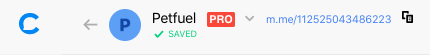

Getting Started With Chatfuel
=============================

It’s time to build your first chatbot with our no-code platform. Let’s
get started with the basics.

In this lab, we will cover following topics:

- Getting Started With Chatfuel
- Laying the Groundwork for Your First Chatbot
- Building Your First Chatbot—Fast
- Connecting Your Bot to a Facebook Page
- Bringing New Users to Your Bot

Chatfuel: https://docs.chatfuel.com/en/articles/2568024-getting-started-with-chatfuel

What skills do I need to build a chatbot?
-----------------------------------------

You don’t need any coding knowledge or previous experience to build a
bot! Chatfuel is an intuitive, no-code platform that anyone can start
using right away.

How do I get started with Chatfuel?
-----------------------------------

1.  Log in to [dashboard.chatfuel.com](http://dashboard.chatfuel.com/)
    using your Facebook account.
2.  [Connect the Facebook
    page](https://www.youtube.com/watch?v=lMA97c2a6Mw) where you want
    your bot to live. *Note: You must be [an admin](https://www.facebook.com/help/289207354498410) of the page to
    do this. Use [our troubleshooting guide](https://www.youtube.com/watch?v=ZBUJcneWnJo) if you have any
    page-connection issues.
3.  Begin building your bot!

Navigating the platform
-----------------------

When you first log in to Chatfuel and select a chatbot, you'll be
dropped into the *Grow* tab.

From here, you can navigate to any of the ten tabs in the left panel:

1.  *[Grow](https://docs.chatfuel.com/en/collections/168746-grow)*
2.  *[Flows](https://docs.chatfuel.com/en/articles/4237017-flow-builder-basics-beta)*
3.  *Automate*
4.  *[Live Chat](https://docs.chatfuel.com/en/articles/849315-live-chat)*
5.  *[Set Up AI](https://docs.chatfuel.com/en/collections/168748-ai)*
6.  *[People](https://docs.chatfuel.com/en/articles/1575151-people-tab)*
7.  *[Reengage](https://docs.chatfuel.com/en/collections/168753-reengage)*
8.  *[Configure](https://docs.chatfuel.com/en/collections/2255099-pro-plan-faqs)*
9.  *[Analyze](https://docs.chatfuel.com/en/collections/168784-analytics)*
10. *[Upgrade](https://docs.chatfuel.com/en/articles/1006870-chatfuel-pro)*

The *Flows*tab (also known as [Flow
Builder](https://youtu.be/HX-zA-DkPaU)) is where you'll find all the
elements to build a successful chatbot. We’ll cover the rest in other
articles.

The basic anatomy of a Chatfuel bot
-----------------------------------

A Chatfuel chatbot is made up of cards. Cards contain content in some
form, and they can also contain plugins that will direct your users to
the next part of the flow, export their data, or perform some other
action. Cards are empty until you [add
content](https://docs.chatfuel.com/en/articles/925465-asset-guide)
and/or plugins.

(Learn more about the [different elements you can
add](https://docs.chatfuel.com/en/articles/4237017-flow-builder-basics-beta)
to a bot in the *Flows* tab.)

Here's a simple card with text.👇

Use
**[buttons](https://docs.chatfuel.com/en/articles/4295145-the-difference-between-buttons-and-quick-replies)**
to allow subscribers to navigate from card to card. When someone clicks
or taps a button, they receive the card you connected to that button.

**Quick replies** serve the same function as buttons. They’re just
another way for bot users to move through the conversation by navigating
from one card to another.

By the way: A **chatbot user** is someone who has engaged with your
bot and is now considered “reachable” by your business via Messenger.
It’s just like how someone who signs up for your email list is now
reachable by your business via email. Bot users are counted as such
until you delete them from your *People* tab (or until they block your
bot on their side).

Moving on, you can navigate through different sections of your chatbot
in the left-hand panel. There, you'll see: 

-   **Groups**, which are there to help you keep yourself organized.
    Groups are represented by the 📁 icon, and they contain flow(s). (In
    the image below, *Default group* and *FAQ* are groups.) You can
    rename groups as desired. Note that groups are only visible to you,
    the chatbot builder, not your users.
-   **Flows**, which are groups of cards that make up a conversational
    path between your bot and a user. For example, you might have a
    product recommendation flow inside a group called *Prospective
    customers*, and that flow would be made up of cards that represent
    individual chatbot messages and actions related to giving the user
    product recommendations.

Click on the arrow next to a group name to expand it and see the flows
inside. Click on a flow to display it in the main workspace. Once you've
done that, you can click on any card in that flow to edit its content.

Can I change the language of my Chatfuel dashboard?
---------------------------------------------------

The Chatfuel dashboard is currently available only in English. If you
access the dashboard via Google Chrome, you can view [a
translation](https://support.google.com/chrome/answer/173424?co=GENIE.Platform%3DDesktop&hl=en)
of the page in the language of your choice.

*Did you know you can [make your chatbot
multilingual](https://blog.chatfuel.com/how-to-create-a-multilingual-chatbot/)?
Read this for tips on how to [switch the language of your
bot](https://docs.chatfuel.com/en/articles/2931038-tips-for-creating-multi-lingual-bots).
🌎*

To sum up: 
-----------

-   Bots are designed to mimic human conversation. 
-   A chatbot flow takes the same format as a conversation with a
    friend: questions, possible responses, and answers based on those
    responses.
-   Cards contain content your bot will share with users. Buttons and
    quick replies represent user options for responding to that content.

1. Laying the Groundwork for Your First Chatbot
===============================================

Anyone can build a bot with Chatfuel—no code necessary. Here's how to
prepare and plan for designing your first one.

\#1. Choose a goal and map your flow.
-------------------------------------

Decide on the goal for your bot. Is it to gather and qualify leads?
Answer questions? Push people to your online store [to make a
purchase](https://blog.chatfuel.com/boost-sales-with-your-bot-expert-tips-from-jacqueline-samira/)?
Choose just one main purpose to start with, and map out a conversation
of questions and answer options that will bring users to that desired
end point. (You can use pen and paper to do this, a digital tool like
[Draw.io](http://draw.io/), or in Chatfuel's intuitive, visual Flow
Builder interface.)

Here's an example of a more complex bot flow mapped out in
[Draw.io.](http://draw.io/) 

However, the most successful bots we see normally start with a very
simple[flow that answers
FAQs](https://chatfuel.com/blog/category/agencies). A chatbot flow
doesn't need to be huge and complex in order to be useful—it's actually
quite the opposite! So think about the main problem you're trying to
solve and start there. You'll be able to build additional
functionalities into your bot as you go.

\#2. Plan a bot that’s proactive.
---------------------------------

Make your bot a proactive tool instead of a reactive one. Have it ask
questions and offer predefined answer options for the user to choose
from, in the form of [buttons or quick
replies. ](https://docs.chatfuel.com/en/articles/4295145-the-difference-between-buttons-and-quick-replies)

Having your bot lead the conversation like this will minimize the work
the user has to do to get the information or assistance they need. The
result? [More
conversions](https://chatfuel.com/blog/posts/whisky-brand-triples-conversion-rates-with-gift-recommendation-chatbot),
and a more streamlined experience! 🙌

\#3. Plan your bot's persona.
-----------------------------

Your bot will act as a virtual ambassador for your brand, so it needs to
make the right first impression. 👋 Plan out a friendly [Welcome
Message](https://blog.chatfuel.com/welcome-message-best-practices/) that
lets the user know they’re chatting with a bot, and tells them how it
can help. You may even want to [choose a name for your
chatbot](https://blog.chatfuel.com/how-to-choose-a-name-for-your-facebook-messenger-chatbot/). 

Don’t forget to [design all bot content to match your brand
voice](https://youtu.be/ZIUTFnRyJZI), so you can provide a consistent
experience across channels. 

-   The bot for a kids clothing brand, for example, might use upbeat,
    imaginative language and emoji. 🤸🏻‍♀️The bot for a luxury jewelry
    brand, on the other hand, would likely take a more formal tone.

4. Plan for compliance with Facebook’s Messenger policy.
----------------------------------------------------------

Facebook has rules for how businesses can communicate with users via
Messenger bot. These rules exist to protect users from spam, and to make
sure they get maximum value from Messenger. 

Before building, get to know [these six key
principles](https://blog.chatfuel.com/how-to-make-sure-your-chatbot-is-compliant-with-facebook-policies/)
from the Facebook Messenger policy. When you design your bot, make sure
it complies.

## 2. Building Your First Chatbot—Fast

Start reaping the benefits of a Messenger chatbot right away, thanks to
these quick-start tools you’ll find in the Chatfuel platform.

There are two easy, no-code ways to kick-start the bot-building process
in Chatfuel: **bot templates** and **pre-built flows.**

**What are Chatfuel’s bot templates?**
--------------------------------------

Our [bot templates](https://blog.chatfuel.com/chatfuel-messenger-bot-templates/)
are fully formed frameworks for an entire bot.

**For chatbots in the *Automate*tab**

There are almost 100 templates available for bots built in the
*Automate*tab. You can find these in Chatfuel's templates library (by
clicking **Choose from template** when you first log in to your Chatfuel
dashboard), and most are free.

Some templates are for a single chatbot function, like lead scoring or
audience segmentation. But most are for full bots that will accomplish
multiple functions for a specific type of business, like restaurants,
dentists, marketing agencies, or ecommerce brands.

-   The *Shopify* template, for example, includes pre-prepared blocks
    that will allow your bot to offer customer service, product quizzes,
    giveaways, post-purchase check-in messages, abandoned-cart
    reminders, and more.

**For chatbots in the *Flows*tab**

Templates for chatbots built in the
*[Flows](https://youtu.be/HX-zA-DkPaU)*[tab](https://youtu.be/HX-zA-DkPaU)
take the form of [shareable links](https://youtu.be/QcNZXxdNMR8). We'll
soon have a library of these available for users too.

**How to use a bot template**
-----------------------------

**For chatbots in the *Automate*tab**

You’ll find our bot templates in your Chatfuel dashboard. They’re
organized into categories in the bar at the top of the screen.\

Using a bot template is simple:

1.  Click on the desired template. A window will pop up where you can
    read more about what it includes. ⬆️
2.  In that pop-up, click **Preview in Messenger** to chat with a sample
    version of that bot.
3.  If it seems like a good fit for your business and objectives, click
    **Use Template.** The template will then be loaded into a brand-new
    bot in your dashboard.
4.  Enter that bot, and you’ll see all the blocks already set up for
    you. All that’s left to do is customize the content in the blocks as
    needed to fit your business. You can delete or add any blocks if
    necessary.

You can use a template in its entirety, or pick and choose pieces of it
that work best for your project. Or, you can play with a few templates
to get a better grasp on how a great bot is designed, and then go on to
build your own from scratch. Either way, templates are great resources
for helping you build a chatbot, fast. 🏎️

**For chatbots in the *Flows*tab**

To access a template for a chatbot built in the *Flows* tab, click its
link. (For example, [here's the link to the template for FAQ
automation](https://chatfuel.com/share?flowGroup=5f7df73a5853af7acd0fabf9).)
The entire flow will appear in a new window.

To see what interacting with the flow will be like for users, click
**Test this flow** in the bottom right corner of the screen.

To add the flow to a chatbot so you can customize it, click **Save group
to bot**. A new window will appear where you'll be asked to select a
chatbot that you want to save this flow to. You can choose an existing
bot from the list (click **Refetch bot list** if the one you want
doesn't appear) and click **Save Group** next to that bot. Or you can
click **Create a bot** to add the template to a new, blank chatbot.

Next, click **View Group** next to the bot you chose to be taken to the
customizable template in that bot. (If you chose **Create a bot**, a
new, blank bot will now appear in the list, so you can click **Save
Group**and then **View Group** next to that bot.)

From there, you'll be able to customize any/all elements of the bot.
(Cards outlined in red must be customized before you'll be able to
launch your bot.)

You can get full instructions on installing, customizing, and launching
the FAQs template here, for example, if you'd like step-by-step
guidance. 👇

**What are Chatfuel’s pre-built flows?**
----------------------------------------

***Note****: Pre-built flows are only for chatbots built in
the*Automate*tab.*

Think of a [pre-built
flow](https://blog.chatfuel.com/build-bots-faster-with-chatfuel-pre-built-flows/)
as a script for a specific part of your bot’s conversation with a user.

-   Let’s say you want to qualify leads. The pre-built flow for that
    purpose will already have the appropriate questions and answer
    options set up for you in blocks. You’ll just have to customize the
    text to your unique business, and you’ll be ready to go.

In Chatfuel, you’ll find pre-set bot flows for four basic functions, or
"**skills:"**

1.  Saving time by automating FAQs
2.  Increasing sales by collecting emails and phone numbers
3.  Qualifying leads
4.  Taking over the conversation with live chat

**How to use a pre-built flow**
-------------------------------

You’ll find all the pre-built flows in the *Add Element* bar at the
bottom of the work area in the *Automate* tab. 

To insert one into your bot, click the **Pre-Built Flows** button. Then:

1.  Of the four available, select the skill that you want to add to your
    bot.

​2. Now, the blocks you’ll need for your bot to accomplish the task you
chose will appear in the workspace. Above them, you’ll see an optional
to-do list of tasks that will guide you through the customization of
your pre-built flow. ✅

​3. Modify the content in the new blocks as necessary to match your
bot’s persona and objectives. For example, if you chose the *Automate
FAQs*option, you’ll need to customize up to ten questions and answers
that apply to your business and will be helpful for your users.

Once you've customized the content, here are your possible next steps:

-   If the pre-built flow you choose accomplishes all you need your bot
    to do, you can launch right away.
-   If you need more functionalities than just this one, use the
    pre-built flow(s) as building blocks in creating a larger, more
    complex bot.
-   Use the pre-built flows as learning tools, just so you can get the
    hang of how to effectively build flows for different objectives. 💡

**Building a bot from scratch**

If you prefer to have a completely custom bot, you can start from
scratch. Watch this quick tutorial to get the basics on how to construct
a simple flow. 👇

Want more detailed inspiration on bots for specific use cases? Visit our
blog to learn more about chatbots for:

-   [Recruiting and
    HR](https://blog.chatfuel.com/facebook-messenger-bot-for-hr-and-hiring/)
-   [Restaurants](https://blog.chatfuel.com/restaurant-chatbot/)
-   [Agriculture ](https://blog.chatfuel.com/how-to-create-a-chatbot-for-farmers-and-agriculture/)
-   [Beauty
    businesses](https://blog.chatfuel.com/how-a-beauty-chatbot-for-facebook-messenger-can-benefit-your-salon-or-cosmetics-business/)
-   [Healthcare
    businesses](https://blog.chatfuel.com/how-to-build-a-healthcare-chatbot-for-facebook-messenger/)
-   [Banking and
    finance](https://blog.chatfuel.com/how-a-bank-or-finance-business-can-benefit-from-a-chatbot/)
-   [Real
    estate](https://blog.chatfuel.com/how-to-create-an-effective-facebook-messenger-chatbot-for-real-estate/)

## 3. Connecting Your Bot to a Facebook Page

To interact with users, your bot must be published. To publish your bot,
connect it to a Facebook page.

Once you've [built your Messenger chatbot,
you can set it live (so it can communicate with users) by connecting it
to a Facebook page. Here's how:

1.  Go to the *Grow* tab in Chatfuel.
2.  Under the *Facebook pages* section, you'll see a list of pages
    associated with your account.
3.  Choose the Facebook page you want to connect your bot to, and click
    the **Connect** button next to that page.

If you ever want to disable your chatbot, click **Disconnect** in the
same section.

If you ever want to connect your chatbot to a different Facebook page,
click **Disconnect** in the same section, then click **Connect** next to
the desired page.

### Before connecting your bot to a Facebook page

Go through this checklist before publishing your bot to make sure the
connection process will go smoothly.

1.  **Make sure you're an Admin of the Facebook page 👤** You must be an
    admin of the Facebook page in question to connect a bot to it. Page
    roles like editor or moderator won't have sufficient permissions for
    connecting chatbots. [To view page
    roles](https://www.facebook.com/help/187316341316631), go to the
    Facebook business page and navigate to *Page settings* \> *Page
    roles*.
2.  **Make sure the Chatfuel app has all required permissions 🔑** You'll
    be prompted to grant these permissions when you go through the page
    connection process in Chatfuel. If you're not sure if you granted
    the proper permissions, you can check under *Settings* \> *[Business
    tools](https://www.facebook.com/settings?tab=business_tools)* on
    your Facebook page. Once there, check to make sure the Chatfuel app
    has these four permissions: To manage your pages To send messages
    from pages you manage To send messages from pages you manage at any
    time after the first user interaction To show a list of the pages
    you manage

💡**Reminder**: These permissions simply allow your bot to function on
your page. Chatfuel will never send messages, publish content, or take
any other actions on your page unless you request it.

[.png)](./chatfuel_images/image(1).png)

If you become an admin of a new Facebook page(s) in the future and you
want to connect one to a bot, just click **Update Pages List** in the
*Grow* tab. The new page(s) will appear on the list, and you'll be able
to connect them and grant permissions.

## 4. Bringing New Users to Your Bot

Now that you’ve built a great bot, you’ve got to spread the word. Here
are several ways to bring new users to your chatbot.

First, note that Chatfuel's [Entry Points](https://chatfuel.com/blog/posts/grow-your-audience) are the
easiest and most efficient way to grow your chatbot's audience. We'll
highlight several of these here, in addition to a few other ways to
bring new users to your Messenger chatbot.

**\#1. Promote your bot on Facebook.**
--------------------------------------

-   You can set up Chatfuel’s [Comments Autoreply Entry
    Point](https://docs.chatfuel.com/en/articles/4603539-automatically-respond-to-post-comments-with-the-comments-autoreply-entry-point)
    to apply to a post(s) on your Facebook page. It will enable your bot
    to automatically message all commenters (or only those who comment
    with a keyword(s)). If the person responds to this bot message,
    they’ll become a reachable user. (This method works especially well
    for engaging posts about [contests,
    giveaways](https://chatfuel.com/blog/posts/steps-to-viral-social-media-contest),
    etc.) It's proven to be an amazing way for many of our most
    successful clients to steadily grow their bot user bases, which is
    why it's one of the tools we recommend to all users. 📈

-   You can create a post on your Facebook page with the***Send
    Message*objective**, and compose some text explaining how it can
    help users. Publish and pin the post to encourage anyone who visits
    your page to chat with your bot and become a subscriber.

-   You can set your [Facebook ads to direct users to your
    chatbot](https://chatfuel.com/blog/posts/create-click-to-messenger-ads-to-drive-traffic-to-your-bot).
    When a user clicks on the ad, they’ll be sent to Messenger where
    your bot can engage them immediately. You can really maximize your
    advertising budget by using the data of your existing bot users to
    improve your (re)targeting game. Just use the [Segment Sync
    feature](https://docs.chatfuel.com/en/articles/3705934-segment-sync-to-facebook-ads-manager-beta)
    to automatically upload audiences from the
    *[People](https://docs.chatfuel.com/en/articles/1575151-people-tab)*[tab](https://docs.chatfuel.com/en/articles/1575151-people-tab)
    into your Facebook Ads Manager.

[.png)](./chatfuel_images/image(1).png)

**\#2. Share the link to your bot.**
------------------------------------

-   The simplest way to start promoting your bot and growing your
    subscriber list is to share the **direct link**. All Messenger bots
    have one, and it leads to the [Welcome
    Message](https://blog.chatfuel.com/welcome-message-best-practices/).
    It begins with **m.me**, like **m.me/yourbusinessname**. You can
    find this link at the top of your dashboard, next to your bot’s
    name. 👇

-   The other type of Messenger-bot link is a **bot link**(formerly
    known as REF links). These lead users to a specific block in your
    bot, instead of to the Welcome Message. Bot links are useful if you
    want to take people directly to a certain part of the flow, like to
    survey questions or information about a promotion.

To use a bot link, set up a [Bot Link Entry
Point](https://docs.chatfuel.com/en/articles/4603507-send-users-to-a-specific-flow-with-the-bot-link-entry-point).
👇

[Grow your audience](https://blog.chatfuel.com/grow-your-audience/) by
sharing either of these links in emails, on social media, or anywhere
else you normally interact with prospects and customers.

When sharing the link, you may even want to include a screencast video
of your bot in action to intrigue users and show them what to expect,
like so. 👇

💡 **Tip:** When using bot links on different platforms, create a
different link for each of the sources. That way, when you go into the
*People* tab to check the {{ref}} attribute, you'll be able to see
exactly how many users you got from each of the sources.

**\#3. Promote your bot on other channels.**
--------------------------------------------

### Embed the bot on your website

You can easily have a chat window with your [Messenger bot appear on
your
website](https://blog.chatfuel.com/how-to-add-a-messenger-chatbot-to-your-website/),
too. Set this up using the [Customer Chat Entry
Point](https://docs.chatfuel.com/en/articles/4603514-engage-website-visitors-with-the-customer-chat-entry-point)
feature, so your bot can begin engaging website visitors today.

You can also include a screenshot and a link to your bot right within
blog posts or other pages on your website.

### Share your bot on Instagram

You can also run [click-to-Messenger ads on
Instagram](https://blog.chatfuel.com/use-instagram-ads-to-bring-users-to-your-dms-or-your-messenger-bot/),
meaning the user will be directed from the Instagram ad to your bot in
Messenger. 

Or, you could [work with an influencer](https://youtu.be/ZRhzwkZLAxg) to
promote your bot on Instagram or other social-media channels.

Advanced tools for Instagram messaging are coming soon! [Sign up to
get notified when we launch](https://try.chatfuel.com/instagram) (and
check out these [expert tips for boosting your Instagram
presence](https://youtu.be/rJNxfbkCDOQ) in the meantime).

### Make a landing page for your bot

You could even create and promote an entire landing page just for your
bot, so you can easily showcase its helpful features. Check out this
example from [ABC
News](http://www.abc.net.au/news/abcnews-on-messenger/).👇

### Submit your bot to a directory

Finally, you can submit your bot to directories like [BotList](https://botlist.co/) to increase visibility.  

