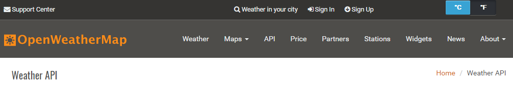
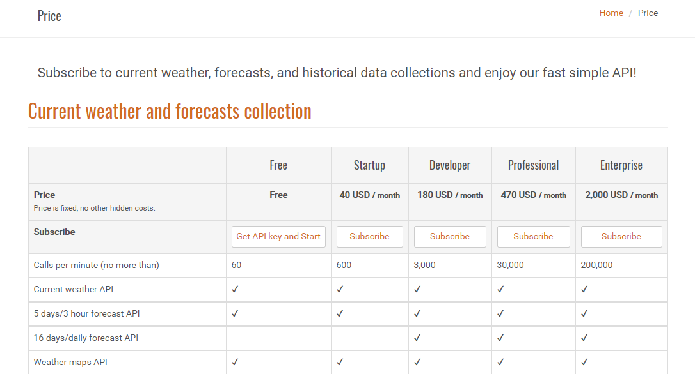
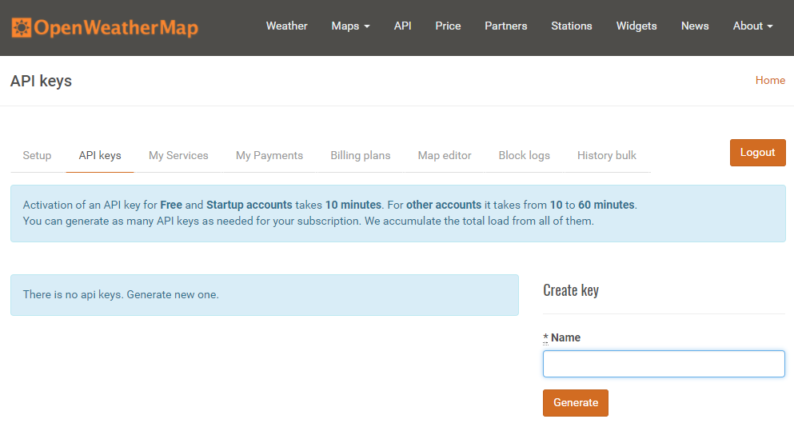
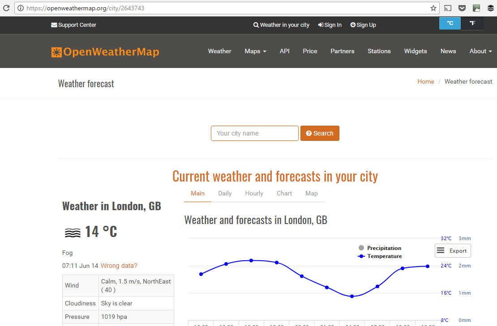
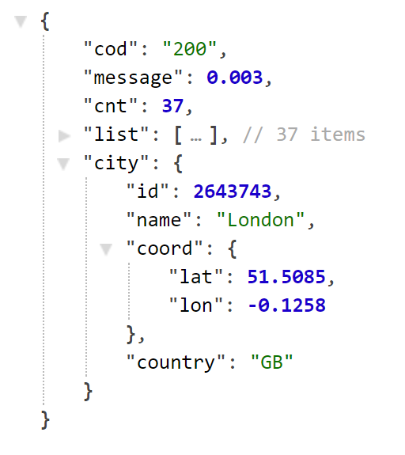
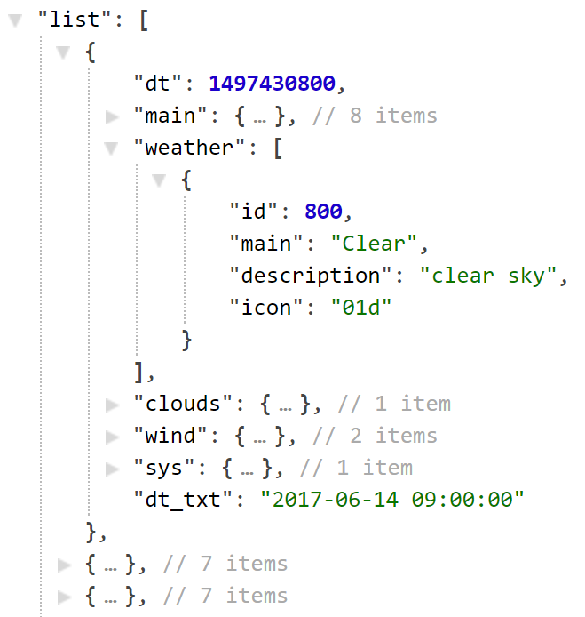
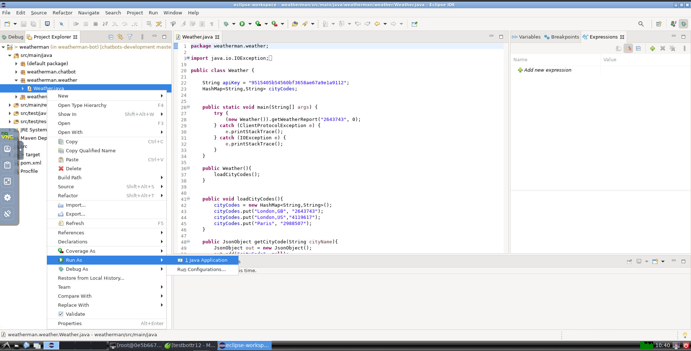
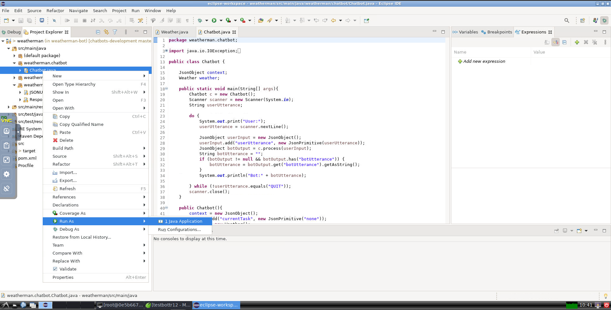
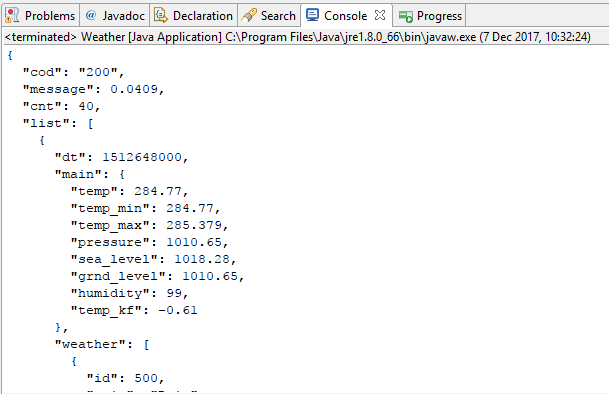

Lab 3. Let\'s Talk Weather 
---------------------------------------

In this lab, we will design and implement a chatbot that can talk
about the weather. We will build a chatbot and integrate it with a
backend service that can provide us with real-time weather information.
We will then go on to integrate the chatbot in Facebook Messenger. And
finally, have a look at the exclusive features of Messenger that can be
used to make the chatbot more attractive and engaging.

By the end of this lab, you will be able to:


-   Design conversational tasks to talk about the weather
-   Create backend integrations using the OpenWeatherMap API,
-   Build a chatbot in Java 8


Backend tasks 
-------------------------------


Before we move on to implementing the chatbot, let us take a look at the
source of information for weather data, [*OpenWeatherMap*]
([https://openweathermap.org](https://openweathermap.org/)).
OpenWeatherMap is a cloud service serving weather info about 200,000+
cities across the globe. It has both current and forecast data as well
as historical data. It has both free and paid services. Navigate to the
website, type your city name, and give it a try.


### Getting weather data 


Let us now set up an account in OpenWeatherMap service to obtain weather
data.


#### Getting the API key 


Unlike the last lab, where we created content for the chatbot
manually, we will be using this data live from the service endpoint. In
order to do this, we need to sign up to this. To sign up, navigate
to [https://home.openweathermap.org/](https://home.openweathermap.org/)
and create a new account.

To get started with the data, we will have to subscribe to the
appropriate API service. To do this, navigate through the website by
clicking the **`API`** option on the main menu on the home page:





On the API page, you will see the listing on all the API services that
are available. Let\'s start with the basic one:
**`Current weather data`**. Click **`Subscribe`**:





Click **`Get API key and Start`**. This will take you to the appid page
(<https://openweathermap.org/appid>) where you can find documentation on
the API (that is, how to use the key and its limitations).

To get your key, you need to go further. Navigate to the **`API keys`**
page: <https://home.openweathermap.org/api_keys>. You will find a
default key. If you don\'t, create one:





Now that we have our key, let\'s give it a try!


#### Trying your key 


We have to construct the URL to get the data we need. Here is a basic
one:


``` 
http://api.openweathermap.org/data/2.5/forecast?id=<CITY_CODE>&APPID=<YOUR_API_KEY>
```

To get your city code, navigate to the following URL:

<https://openweathermap.org/find?q=>

Type **`Your city name`** and click **`Search`**. On the results page,
grab your city code from the URL:





For instance, the city code for [*London,
GB*] is **`2643743`**.

Replace `<YOUR_API_KEY>` with your key and try the URL on a
web browser. You will get a JSON object with current and forecast
weather information, similar to the following one:





The `list`[* *]key with 37 items can be expanded,
in that you will find current and forecast information for every three
hours starting from the current time: 





Brilliant! We now have a data source to plug into our chatbot.


### Lab Solution
Complete solution of this lab is present in following directory:

`/root/Desktop/chatbots-development/Lab03`

Open eclipse IDE by clicking desktop icon:


Run weather api example by running `Weather.java`:



Run chatbot by running `Chatbot.java`:




### Building the backend interface 


Let us now try some code! We are now going to build a module in Java
that can access the weather data from our data source in real time. We
will then plug this module into the chatbot for the conversation manager
to use:


1.  Open Eclipse.
2.  Create a new Maven project.
3.  Choose **`Create a simple project`**.
4.  Provide the location of the project and hit **`Next`**.
5.  On the next page, type **`Group Id`**, **`Artifact Id`**,
    **`Name`**, and **`Description`**. Click **`Finish`**.


We now have a blank Maven project ready.  Before we move on to
developing the backend code, let\'s add a few dependency packages to our
project. Find the POM file (`pom.xml`) and add the following
Maven dependencies:


``` 
<dependencies>
   <!--https://mvnrepository.com/artifact/com.google.code.gson/gson-->
   <dependency>
     <groupId>com.google.code.gson</groupId>
     <artifactId>gson</artifactId>
     <version>2.8.0</version>
   </dependency>
   <!--https://mvnrepository.com/artifact/org.apache.httpcomponents/httpclient-->
   <dependency>
     <groupId>org.apache.httpcomponents</groupId>
     <artifactId>httpclient</artifactId>
     <version>4.5.3</version>
   </dependency>
</dependencies>
```

We may need other dependencies later. But for the backend code, these
packages will suffice. Let\'s now create a Java class,
`Weather.java`, to access weather data. The following code
shows the basic structure of the class:


``` 
package weatherman.weather;

import com.google.gson.JsonObject;

public class Weather {
  public static void main(String[] args) {
  }

  public Weather(){}

  public JsonObject getWeather(String cityCode){ return null; }

  public JsonObject getCurrentWeather(String cityName){ return null; }

}
```

We will now add the necessary code to get the actual data from
OpenWeatherMaps service:


``` 
package weatherman.weather;

import java.io.IOException;

import org.apache.http.HttpResponse;
import org.apache.http.client.ClientProtocolException;
import org.apache.http.client.HttpClient;
import org.apache.http.client.methods.HttpGet;
import org.apache.http.impl.client.HttpClientBuilder;
import org.apache.http.util.EntityUtils;

import com.google.gson.JsonObject;
import com.google.gson.JsonParser;

public class Weather {

 //put your api key here
 String apiKey = <Your API key>;

 public static void main(String[] args) {
    try {
        (new Weather()).getWeather("2643743");
    } catch (ClientProtocolException e) {
       e.printStackTrace();
    } catch (IOException e) {
       e.printStackTrace();
    }
 }

 public Weather(){}

 public JsonObject getWeather(String cityCode) 
               throws ClientProtocolException, IOException {

    //step 1: Prepare the url
    String url = "http://api.openweathermap.org/data/2.5/forecast?id=" 
       + cityCode + "&APPID=" + apiKey ;

    //step 2: Create a HTTP client
    HttpClient httpclient = HttpClientBuilder.create().build();

    //step 3: Create a HTTPGet object and execute the url
    HttpGet httpGet = new HttpGet(url);
    HttpResponse response = httpclient.execute(httpGet);

    //step 4: Process the result
    JsonObject json = null;
    int statusCode = response.getStatusLine().getStatusCode();
    if (statusCode == 200) {
       String response_string = EntityUtils.toString(response.getEntity());
       json = (new JsonParser()).parse(response_string).getAsJsonObject();
       Gson gson = new GsonBuilder().setPrettyPrinting().create();
       String prettyJson = gson.toJson(json);
       System.out.println(prettyJson);
    }
    return json;
 }

}
```

In the `main` method, we have instantiated a
`Weather` object to get current weather for London, GB
(`2643743`). Run the preceding code and you will get the
following result in the console:





The result is in the form of a JSON object that we can use to respond to
weather inquiries. In the [*list*] item, there are 36 items.
Each of those items provides weather data, such as average temperature
(`temp`), minimum temperature (`temp_min`), and
maximum temperature (`temp_max`) at a particular time
(`dt` being the timestamp). Let\'s now implement two
methods, `getWeatherAtTime()` and
`getWeatherReport()`, to generate a short weather report:


``` 
public String getWeatherReport(String cityCode, Integer i) 
                   throws ClientProtocolException, IOException{

   JsonObject currentWeather = null;
   if (cityCode != null){ 
      currentWeather = getWeatherAtTime(cityCode, i);
   }

   String weatherReport = null;
   if (currentWeather != null){
     JsonObject weather = currentWeather.get("weather")
             .getAsJsonArray().get(0).getAsJsonObject();
     Double avgTemp = Double.valueOf(currentWeather.get("main")
     .getAsJsonObject().get("temp").getAsString()) - 273.15;
     String avgTempSt = String.valueOf(avgTemp).split("\\.")[0];

     weatherReport = "The temperature is " + avgTempSt + 
                    " degrees Celsius. " 
                    + weather.get("description").getAsString() + ".";
   }
   System.out.println(weatherReport);
   return weatherReport;
}

public JsonObject getWeatherAtTime(String cityCode, Integer i) 
                    throws ClientProtocolException, IOException{

   JsonObject json = getWeather(cityCode);
   JsonArray list = json.get("list").getAsJsonArray();
   JsonObject weatherAtTime = list.get(i).getAsJsonObject();
   return weatherAtTime;
}
```

You might have noticed that the `getWeatherReport()` needs two
parameters---city code and time. Time is passed as an integer with
`0` being the current time, `1` being the next slot,
and so on. Calling the `getWeatherReport()` method from
`main` with the name of the city and time as parameters will
result in a short textual weather report like the following one:


``` 
Temperature is 297.8 degrees . clear sky.
```

Obviously, given the richness of the data source, we can extend the
number of backend tasks. 


Implementing the chatbot 
------------------------------------------


Now that we have the backend tasks ready, let\'s focus on the chatbot
itself. In general, the chatbot will take the user\'s utterances as
input and respond with utterances of its own. However, since we are
building a chatbot for Facebook Messenger, our chatbot will mostly take
input in the form of button presses and respond using both utterances
and visually appealing cards.

Let\'s start by implementing the `Chatbot.java` class. We will
begin by working out an algorithm to process and respond to users\'
utterances:


1.  Process user input.
2.  Update context.
3.  Identify bot intent.
4.  Generate bot utterance and output structure.
5.  Respond.


This one is a very simple algorithm to start with. First, user input, in
the form of utterances or button presses is processed. Then the context
of the conversation is updated. In the next step, we identify what the
bot needs to say. Once that is determined, we figure out how to say it
and respond. Let us start by implementing the basic structure based on
the mentioned algorithm:


``` 
package weatherman.chatbot;

import com.google.gson.JsonObject;

public class Chatbot {
   JsonObject context;

   public static void main(String[] args){}

   public Chatbot(){
      context = new JsonObject();
   }

   public JsonObject process(JsonObject userInput){

      //step1: process user input
      JsonObject userAction = processUserInput(userInput);

      //step2: update context
      updateContext(userAction);

      //step3: identify bot intent
      identifyBotIntent();

      //step4: structure output
      JsonObject out = getBotOutput();

      return out;
   }
}
```

We will now modify the `main()` method to simulate a chat
window where the user can type in their requests and responses and have
a chat with the bot:


``` 
public static void main(String[] args){
    Chatbot c = new Chatbot();
    Scanner scanner = new Scanner(System.in);
    String userUtterance;

    do {
       System.out.print("User:");
       userUtterance = scanner.nextLine();

       //end the conversation
       if (userUtterance.equals("QUIT")){ break; } 

       JsonObject userInput = new JsonObject();
       userInput.add("userUtterance", new JsonPrimitive(userUtterance));
       JsonObject botOutput = c.process(userInput);
       String botUtterance = "";
       if (botOutput != null && botOutput.has("botUtterance")) {
          botUtterance = botOutput.get("botUtterance").getAsString();
       }
       System.out.println("Bot:" + botUtterance);

    } while (true);
 }
```

Now, let us focus on the chatbot itself. We will first build a module to
understand users\' utterances. We are going to build a very simple
module using rules and [*regular expressions *]to translate
user utterances into user intents.

[**An intent**] is a formal unambiguous representation of what
the user or the bot says. It conveys the meaning behind an utterance or
a gesture.

Let us first figure out an initial list of user intents for the tasks we
have based on the example conversations that we have created:


-   `greet`
-   `request_current_weather`
-   `inform_city`
-   `thank`


The `greet` intent represents the many different greetings
that the user may use. We will, therefore, translate a number of
utterances such as `hi`, `hi there`,
`hello`, and `hello there` into
the `greet` intent. Similarly, the `thank`
intent represents all ways the user might thank the bot.
The `request_current_weather` intent is used to represent the
utterances where the user is requesting current weather info and
the `inform_city` intent is where they mention the name of the
city:


``` 
public JsonObject processUserInput(JsonObject userInput){ 
   String userUtterance = null; 
   JsonObject userAction = new JsonObject(); 

   //default case 
   userAction.add("userIntent", new JsonPrimitive("")); 
   if (userInput.has("userUtterance")){ 
      userUtterance = userInput.get("userUtterance").getAsString(); 
      userUtterance = userUtterance.replaceAll("%2C", ","); 
   } 

   if (userUtterance.matches("(hi|hello)( there)?")){ 
      userAction.add("userIntent", new JsonPrimitive("greet")); 
   } 
   else if (userUtterance.matches("(thanks)|(thank you)")){
      userAction.add("userIntent", new JsonPrimitive("thank")); 
   } 
   else if (userUtterance.matches("current weather")||
              userUtterance.matches("weather now")){ 
      userAction.add("userIntent", new  
      JsonPrimitive("request_current_weather")); 
   } 
   else { 
      //contextual processing
      String currentTask = context.get("currentTask").getAsString(); 
      String botIntent = context.get("botIntent").getAsString(); 
      if (currentTask.equals("requestWeather") &&  
                 botIntent.equals("requestPlace")){ 
         userAction.add("userIntent", new 
         JsonPrimitive("inform_city"));
         userAction.add("cityName", new JsonPrimitive(userUtterance)); 
      } 
   } 
   return userAction; 
}
```

In the preceding code, we derive the user\'s intent from the utterance.
Some intents have associated parameters as well. For instance,
the `inform_city` intent has an
associated `cityName` parameter which represents the name of
the city for which the user is seeking a weather report. Interestingly,
the `inform_city` intent is also an intent that we derive from
context. Because, when asked for city information, the user merely
mentions the name of the city. So anything typed in will be reported as
a city name and will need to be validated later. Intent and its
associated parameters are boxed up as a JSON object
`userAction`. Let us move on to updating the context:


``` 
public void updateContext(JsonObject userAction){ 
   //copy userIntent 
   context.add("userIntent", userAction.get("userIntent")); 
   // 
   String userIntent = context.get("userIntent").getAsString(); 
   if (userIntent.equals("greet")){ 
      context.add("currentTask", new JsonPrimitive("greetUser")); 
   } else if (userIntent.equals("request_current_weather")){
      context.add("currentTask", new JsonPrimitive("requestWeather"));
      context.add("timeOfWeather", new JsonPrimitive("current"));
      context.add("placeOfWeather", new JsonPrimitive("unknown")); 
      context.add("placeName", new JsonPrimitive("unknown")); 
   } else if (userIntent.equals("inform_city")){ 
      String cityName = userAction.get("cityName").getAsString(); 
      JsonObject cityInfo = weather.getCityCode(cityName); 
      if (!cityInfo.get("cityCode").isJsonNull()){ 
         context.add("placeOfWeather", cityInfo.get("cityCode"));
         context.add("placeName", cityInfo.get("cityName")); 
      } 
   } else if (userIntent.equals("thank")){ 
      context.add("currentTask", new JsonPrimitive("thankUser")); 
   } 
}
```

In the preceding code, we updated the context of the conversation using
the input from the user. Here, the user input is translated into tasks
and parameters. The idea behind context is the same as how humans keep
the context of conversation while talking to someone.
The `currentTask` variable represents the current task of the
chatbot. Intents such as `greet`, `thank`, and
`request_current_weather` will set this variable. Each task
will have a number of parameters that need to be filled in. For
instance, the `requestWeather` task has two slots: time and
place. They need to be filled before the bot can get the weather report.
If the user asks for current weather, the time is set to
`current`, but the place is still unknown. Next step: identify
the bot\'s intent!

Having updated the context, the chatbot\'s intent needs to be
determined. For some tasks, such as greeting and thanking the user, bot
intents are quite straightforward. For other complex tasks, the intents
are determined based on the slots that need to be filled and the
response from backend tasks. We have the following intents for the bot:


-   `greetUser`
-   `thankUser`
-   `requestPlace`
-   `informWeather`


`greetUser` and `thankUser` are used to greet and
thank users. `requestPlace` is used when the bot needs to know
the place of the weather report. `informWeather` is used when
the bot has successfully retrieved a report from the backend service
that we have built in the previous section:


``` 
public void identifyBotIntent(){ 
   String currentTask = context.get("currentTask").getAsString(); 

   if (currentTask.equals("greetUser")){ 
      context.add("botIntent", new JsonPrimitive("greetUser")); 
   } else if (currentTask.equals("thankUser")){ 
      context.add("botIntent", new JsonPrimitive("thankUser")); 
   } else if (currentTask.equals("requestWeather")){ 
      if 
      (context.get("placeOfWeather").getAsString().equals("unknown")){ 
        context.add("botIntent", new JsonPrimitive("requestPlace")); 
      }  
      else {  
        Integer time = -1; 
        if 
        (context.get("timeOfWeather").getAsString().equals("current")){ 
          time = 0; 
        } 
        String weatherReport = null; 
        try { 
          weatherReport = weather.getWeatherReport(
             context.get("placeOfWeather").getAsString(), time); 
        } 
        catch (ClientProtocolException e) { 
          e.printStackTrace();  
        } catch (IOException e) { 
          e.printStackTrace(); 
        } 
        if (weatherReport != null){ 
          context.add("weatherReport", new 
                      JsonPrimitive(weatherReport));
          context.add("botIntent", new JsonPrimitive("informWeather")); 
        } 
     } 
   } else { 
     context.add("botIntent", null); 
   } 
}
```

In the preceding code, notice how the bot decides what to do when the
`currentTask` is `requestWeather`. It decides to ask
for the place when it is not known. And when both the time and place are
known, it fetches the report and updates the context. Next, the bot\'s
intent needs to be translated into an utterance:


``` 
public JsonObject getBotOutput(){ 
   JsonObject out = new JsonObject(); 
   String botIntent = context.get("botIntent").getAsString(); 
   String botUtterance = ""; 

   if (botIntent.equals("greetUser")){ 
      botUtterance = "Hi there! I am WeatherMan, your weather bot! " 
         + "What would you like to know? Current weather or forecast?";  
   } else if (botIntent.equals("thankUser")){ 
      botUtterance = "Thanks for talking to me! Have a great day!!"; 
   } else if (botIntent.equals("requestPlace")){ 
      botUtterance = "Ok. Which city?"; 
   } else if (botIntent.equals("informWeather")){ 
      String timeDescription  =     
         getTimeDescription(context.get("timeOfWeather").getAsString()); 
      String placeDescription = getPlaceDescription(); 
      String weatherReport = context.get("weatherReport").getAsString(); 
      botUtterance = "Ok. Weather " + timeDescription + " in " + 
         placeDescription + ". " +  weatherReport; 
   } 
   out.add("botIntent", context.get("botIntent")); 
   out.add("botUtterance", new JsonPrimitive(botUtterance)); 
   return out; 
}

private String getPlaceDescription() { 
   return context.get("placeName").getAsString(); 
}
private String getTimeDescription(String timeOfWeather) { 
   if (timeOfWeather.equals("current")){ 
      return "now"; 
   } 
   return null; 
}
```

Now that the bot\'s intent and utterance are identified, let us execute
the `main` method and have some fun! Run the
`Chatbot` class. On the
console, you will be prompted to start the conversation. Have a look at
the following example conversation:


``` 
User:hi there
Bot:Hi there! I am WeatherMan, your weather bot! What would you like to know? Current weather or forecast?
User:current weather
Bot:Ok. Which city?
User:London,GB
Bot:Ok. Weather now in London,GB. The temperature is 291.72 degrees Farenheit. broken clouds.
User:thanks
Bot:Thanks for talking to me! Have a great day!!
User:QUIT
```

