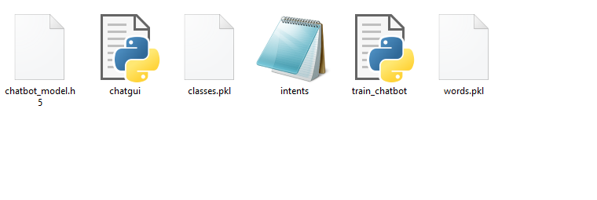
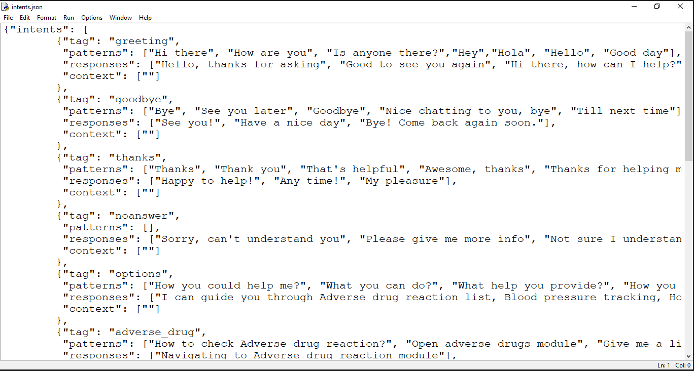
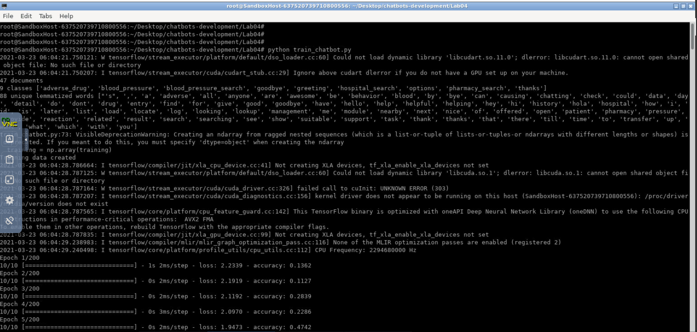

Lab 4: Build Chatbot using NLTK & Keras
=======================================


### What is Chatbot? 

A chatbot is an intelligent piece of software that is capable of
communicating and performing actions similar to a human. Chatbots are
used a lot in customer interaction, marketing on social network sites
and instantly messaging the client. There are two basic types of chatbot
models based on how they are built; Retrieval based and Generative based
models.


### Prerequisites 

The project requires python modules: tensorflow, Keras, and *Natural language processing (NLTK)* packages installed ( Packages have been downloaded already)


``` 
pip3 install tensorflow keras nltk
```

### How to Make Chatbot in Python? 

Now we are going to build the chatbot using Python but first, let us see
the file structure and the type of files we will be creating:



-   **Intents.json –** The data file which has predefined patterns and
    responses.
-   **train\_chatbot.py –** In this Python file, we wrote a script to
    build the model and train our chatbot.
-   **Words.pkl –** This is a pickle file in which we store the words
    Python object that contains a list of our vocabulary.
-   **Classes.pkl –** The classes pickle file contains the list of
    categories.
-   **Chatbot\_model.h5 –** This is the trained model that contains
    information about the model and has weights of the neurons.
-   **Chatgui.py –** This is the Python script in which we implemented
    GUI for our chatbot. Users can easily interact with the bot.

Here are the 5 steps to create a chatbot in Python from scratch:

1.  Import and load the data file
2.  Preprocess data
3.  Create training and testing data
4.  Build the model
5.  Predict the response

**1. Import and load the data file**

First, make a file name as train\_chatbot.py. We import the necessary
packages for our chatbot and initialize the variables we will use in our
Python project.

The data file is in JSON format so we used the json package to parse the
JSON file into Python.


``` 
import nltk
from nltk.stem import WordNetLemmatizer
lemmatizer = WordNetLemmatizer()
import json
import pickle

import numpy as np
from keras.models import Sequential
from keras.layers import Dense, Activation, Dropout
from keras.optimizers import SGD
import random

words=[]
classes = []
documents = []
ignore_words = ['?', '!']
data_file = open('intents.json').read()
intents = json.loads(data_file)
```

This is how our intents.json file looks like.




**2. Preprocess data**

When working with text data, we need to perform various preprocessing on
the data before we make a machine learning or a deep learning model.
Based on the requirements we need to apply various operations to
preprocess the data.

Tokenizing is the most basic and first thing you can do on text data.
Tokenizing is the process of breaking the whole text into small parts
like words.

Here we iterate through the patterns and tokenize the sentence using
nltk.word\_tokenize() function and append each word in the words list.
We also create a list of classes for our tags.


``` 
for intent in intents['intents']:
    for pattern in intent['patterns']:

        #tokenize each word
        w = nltk.word_tokenize(pattern)
        words.extend(w)
        #add documents in the corpus
        documents.append((w, intent['tag']))

        # add to our classes list
        if intent['tag'] not in classes:
            classes.append(intent['tag'])
```

Now we will lemmatize each word and remove duplicate words from the
list. Lemmatizing is the process of converting a word into its lemma
form and then creating a pickle file to store the Python objects which
we will use while predicting.


``` 
# lemmatize, lower each word and remove duplicates
words = [lemmatizer.lemmatize(w.lower()) for w in words if w not in ignore_words]
words = sorted(list(set(words)))
# sort classes
classes = sorted(list(set(classes)))
# documents = combination between patterns and intents
print (len(documents), "documents")
# classes = intents
print (len(classes), "classes", classes)
# words = all words, vocabulary
print (len(words), "unique lemmatized words", words)

pickle.dump(words,open('words.pkl','wb'))
pickle.dump(classes,open('classes.pkl','wb'))
```


**3. Create training and testing data**

Now, we will create the training data in which we will provide the input
and the output. Our input will be the pattern and output will be the
class our input pattern belongs to. But the computer doesn’t understand
text so we will convert text into numbers.


``` 
# create our training data
training = []
# create an empty array for our output
output_empty = [0] * len(classes)
# training set, bag of words for each sentence
for doc in documents:
    # initialize our bag of words
    bag = []
    # list of tokenized words for the pattern
    pattern_words = doc[0]
    # lemmatize each word - create base word, in attempt to represent related words
    pattern_words = [lemmatizer.lemmatize(word.lower()) for word in pattern_words]
    # create our bag of words array with 1, if word match found in current pattern
    for w in words:
        bag.append(1) if w in pattern_words else bag.append(0)

    # output is a '0' for each tag and '1' for current tag (for each pattern)
    output_row = list(output_empty)
    output_row[classes.index(doc[1])] = 1

    training.append([bag, output_row])
# shuffle our features and turn into np.array
random.shuffle(training)
training = np.array(training)
# create train and test lists. X - patterns, Y - intents
train_x = list(training[:,0])
train_y = list(training[:,1])
print("Training data created")
```

**4. Build the model**

We have our training data ready, now we will build a deep neural network
that has 3 layers. We use the Keras sequential API for this. After
training the model for 200 epochs, we achieved 100% accuracy on our
model. Let us save the model as ‘chatbot\_model.h5’.


``` 
# Create model - 3 layers. First layer 128 neurons, second layer 64 neurons and 3rd output layer contains number of neurons
# equal to number of intents to predict output intent with softmax
model = Sequential()
model.add(Dense(128, input_shape=(len(train_x[0]),), activation='relu'))
model.add(Dropout(0.5))
model.add(Dense(64, activation='relu'))
model.add(Dropout(0.5))
model.add(Dense(len(train_y[0]), activation='softmax'))

# Compile model. Stochastic gradient descent with Nesterov accelerated gradient gives good results for this model
sgd = SGD(lr=0.01, decay=1e-6, momentum=0.9, nesterov=True)
model.compile(loss='categorical_crossentropy', optimizer=sgd, metrics=['accuracy'])

#fitting and saving the model 
hist = model.fit(np.array(train_x), np.array(train_y), epochs=200, batch_size=5, verbose=1)
model.save('chatbot_model.h5', hist)

print("model created")
```

**5. Predict the response (Graphical User Interface)**

To predict the sentences and get a response from the user to let us
create a new file ‘chatapp.py’.

We will load the trained model and then use a graphical user interface
that will predict the response from the bot. The model will only tell us
the class it belongs to, so we will implement some functions which will
identify the class and then retrieve us a random response from the list
of responses.

Again we import the necessary packages and load the ‘words.pkl’ and
‘classes.pkl’ pickle files which we have created when we trained our
model:


``` 
import nltk
from nltk.stem import WordNetLemmatizer
lemmatizer = WordNetLemmatizer()
import pickle
import numpy as np

from keras.models import load_model
model = load_model('chatbot_model.h5')
import json
import random
intents = json.loads(open('intents.json').read())
words = pickle.load(open('words.pkl','rb'))
classes = pickle.load(open('classes.pkl','rb'))
```

To predict the class, we will need to provide input in the same way as
we did while training. So we will create some functions that will
perform text preprocessing and then predict the class.


``` 
def clean_up_sentence(sentence):
    # tokenize the pattern - split words into array
    sentence_words = nltk.word_tokenize(sentence)
    # stem each word - create short form for word
    sentence_words = [lemmatizer.lemmatize(word.lower()) for word in sentence_words]
    return sentence_words
# return bag of words array: 0 or 1 for each word in the bag that exists in the sentence

def bow(sentence, words, show_details=True):
    # tokenize the pattern
    sentence_words = clean_up_sentence(sentence)
    # bag of words - matrix of N words, vocabulary matrix
    bag = [0]*len(words) 
    for s in sentence_words:
        for i,w in enumerate(words):
            if w == s: 
                # assign 1 if current word is in the vocabulary position
                bag[i] = 1
                if show_details:
                    print ("found in bag: %s" % w)
    return(np.array(bag))

def predict_class(sentence, model):
    # filter out predictions below a threshold
    p = bow(sentence, words,show_details=False)
    res = model.predict(np.array([p]))[0]
    ERROR_THRESHOLD = 0.25
    results = [[i,r] for i,r in enumerate(res) if r>ERROR_THRESHOLD]
    # sort by strength of probability
    results.sort(key=lambda x: x[1], reverse=True)
    return_list = []
    for r in results:
        return_list.append({"intent": classes[r[0]], "probability": str(r[1])})
    return return_list
```


After predicting the class, we will get a random response from the list
of intents.


``` 
def getResponse(ints, intents_json):
    tag = ints[0]['intent']
    list_of_intents = intents_json['intents']
    for i in list_of_intents:
        if(i['tag']== tag):
            result = random.choice(i['responses'])
            break
    return result

def chatbot_response(text):
    ints = predict_class(text, model)
    res = getResponse(ints, intents)
    return res
```

Now we will develop a graphical user interface. Let’s use Tkinter
library which is shipped with tons of useful libraries for GUI. We will
take the input message from the user and then use the helper functions
we have created to get the response from the bot and display it on the
GUI. Here is the full source code for the GUI.


``` 
#Creating GUI with tkinter
import tkinter
from tkinter import *


def send():
    msg = EntryBox.get("1.0",'end-1c').strip()
    EntryBox.delete("0.0",END)

    if msg != '':
        ChatLog.config(state=NORMAL)
        ChatLog.insert(END, "You: " + msg + '\n\n')
        ChatLog.config(foreground="#442265", font=("Verdana", 12 ))

        res = chatbot_response(msg)
        ChatLog.insert(END, "Bot: " + res + '\n\n')

        ChatLog.config(state=DISABLED)
        ChatLog.yview(END)

base = Tk()
base.title("Hello")
base.geometry("400x500")
base.resizable(width=FALSE, height=FALSE)

#Create Chat window
ChatLog = Text(base, bd=0, bg="white", height="8", width="50", font="Arial",)

ChatLog.config(state=DISABLED)

#Bind scrollbar to Chat window
scrollbar = Scrollbar(base, command=ChatLog.yview, cursor="heart")
ChatLog['yscrollcommand'] = scrollbar.set

#Create Button to send message
SendButton = Button(base, font=("Verdana",12,'bold'), text="Send", width="12", height=5,
                    bd=0, bg="#32de97", activebackground="#3c9d9b",fg='#ffffff',
                    command= send )

#Create the box to enter message
EntryBox = Text(base, bd=0, bg="white",width="29", height="5", font="Arial")
#EntryBox.bind("<Return>", send)


#Place all components on the screen
scrollbar.place(x=376,y=6, height=386)
ChatLog.place(x=6,y=6, height=386, width=370)
EntryBox.place(x=128, y=401, height=90, width=265)
SendButton.place(x=6, y=401, height=90)

base.mainloop()
```


**6. Run the chatbot**

To run the chatbot, we have two main files; **train\_chatbot.py** and **chatapp.py**.

First, we train the model using the command in the terminal:


``` 
python train_chatbot.py
```

If we don’t see any error during training, we have successfully created
the model. Then to run the app, we run the second file.


``` 
python chatgui.py
```

The program will open up a GUI window within a few seconds. With the GUI
you can easily chat with the bot.

**Screenshots:**




Summary
-------

In this Python data science project, we understood about chatbots and
implemented a deep learning version of a chatbot in Python which is
accurate. You can customize the data according to business requirements
and train the chatbot with great accuracy. Chatbots are used everywhere
and all businesses are looking forward to implementing bot in their
workflow.
