Lab 5. Let\'s Catch a Train 
----------------------------------------


In this lab, we will design and build a chatbot to help users plan
their train journeys. We will use a Transport data API to obtain
information about trains, their arrival and departure timings at
stations, and so on, and to serve the information, build a chatbot to
interact with users in natural language. We will then explore how the
chatbot can be exposed to the SMS platform. We will learn to use the
services of a communications API provider called Twilio. We will also
learn how to plug in toolkits such as API.AI to understand user
utterances and manage the conversation in an SMS chatbot. 

First, let\'s take a look at the Transport API and the data that it has
to offer. Based on the data that is available, we will then brainstorm
and design some sample conversational tasks. We will then build a simple
one-way SMS bot that can send timely notifications to users. And build
on that to develop a two-way chatbot that sends train information to
users based on their requests in natural language. We will explore how
to build and integrate API.AI agents into our chatbot to understand
language and drive the conversation.

By the end of this lab, you will be able to:


-   Design conversational tasks based on data
-   Create backend task modules using Transport API
-   Build SMS bots using Twilio


### Lab Solution
Complete solution of this lab is present in following directory. Run "npm install" in the terminal to download node modules and run application:

`/root/Desktop/chatbots-development/Lab05`


Exploring Transport API 
-----------------------------------------


To get started, let\'s have a look at the data source that we are going
to use in this lab. Transport API is a data service for all public
transport services in the UK. If you are in a different country, you
would be able to find something similar to your country. But you can
still play around with this service. Transport API is a data platform
for transport data providing information on live arrivals and
departures, timetables, journey planning, fares, performance indicators,
and commuters tweet mapping. Data is served using RESTful web services.


### Creating a developer account 


1.  To get started, create a developer account
    at [https://developer.transportapi.com](https://developer.transportapi.com/)
    and get an app key and app ID:


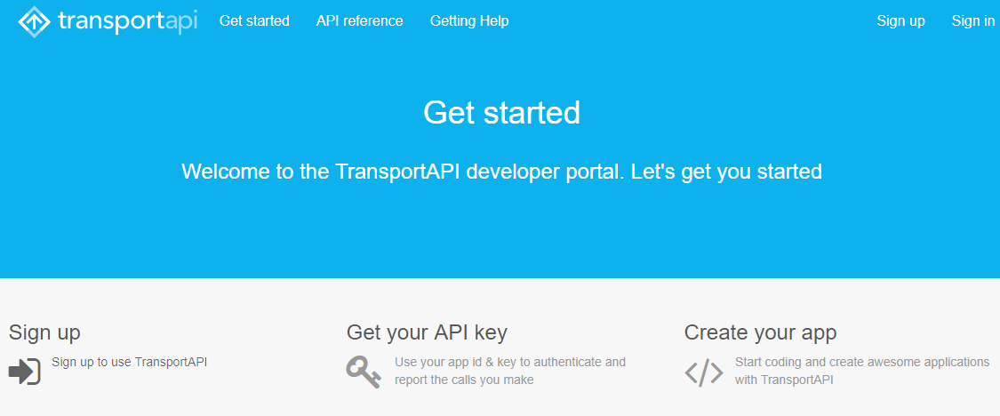


2.  Let\'s try the following sample request. Replace
    `YOUR_APP_ID` and `YOUR_APP_KEY` with your app
    ID and key. Execute the following `GET` request from a web
    browser. At this request, we are trying to retrieve information
    concerning Euston train station, in London:


``` 
http://transportapi.com/v3/uk/places.json?query=euston&type=train_station&app_id=
YOUR_APP_ID&app_key=YOUR_APP_KEY
```

The preceding request will return a JSON response with information such
as the full name of the station, its latitude and longitude coordinates,
and station code:


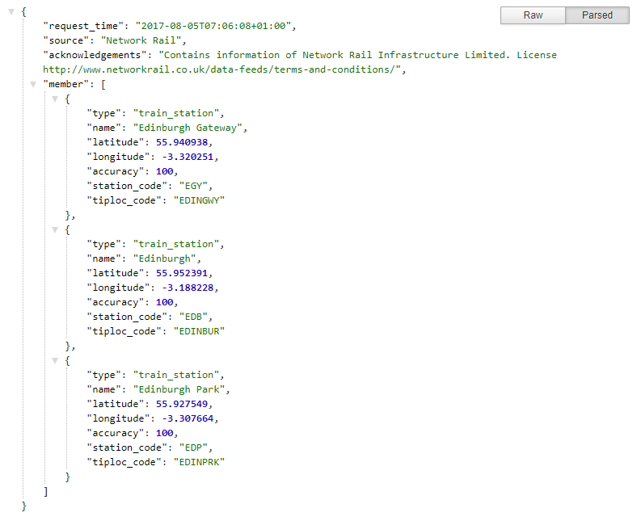


### Exploring the dataset 


Transport API provides data regarding trains, buses, the tube (subway),
and many other forms of transport. To build our chatbot, let\'s begin
with just the trains\' data. In this section, let\'s take a look at the
different kinds of data available about trains. For all requests, the
base URL is `http://transportapi.com/v3/uk/`.


#### Train stations near you 


This endpoint provides a list of train stations near a given location.
The search location should be provided as a latLon coordinate, as
follows:


``` 
http://transportapi.com/v3/uk/train/stations/near.json?lat=55.9485&lon=-3.2021&app_id=YOUR_APP_ID&app_key=YOUR_APP_KEY
```


##### Response 


The response we get is a list of stations near the given latLon
coordinates. For each station, we get its name, location, and station
code:


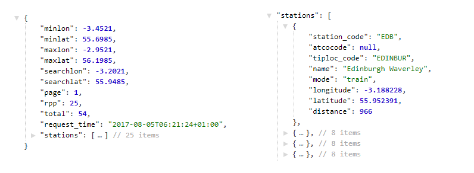


#### Trains in the area 


Train stations can also be searched by providing a bounding box. The
top-left and bottom-right coordinates of the box need to be provided.
This is particularly useful if you need a list of all stations with city
limits or something similar. Let\'s try this using the bounding box
coordinates for Edinburgh:


``` 
http://transportapi.com/v3/uk/train/stations/bbox.json?minlon=-3.4521&minlat=55.6985&maxlon=-2.9521&maxlat=56.1985&app_id=YOUR_APP_ID&app_key=YOUR_APP_KEY
```


##### Response 


The response we get is as follows:


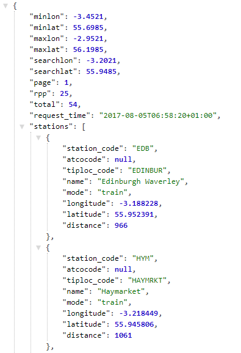


#### Live departures 


The live status of trains arriving and departing a given station can be
obtained using the following endpoint. Let\'s try it out for Edinburgh
Waverley station, whose station code is `EDB`:


``` 
http://transportapi.com/v3/uk/train/station/EDB/live.json?&app_id=YOUR_APP_ID&app_key=YOUR_APP_KEY
```


##### Response 


Here is its response:


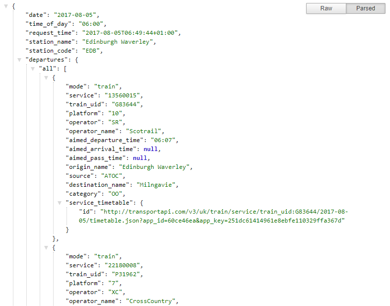


#### Station timetables 


Timetables of trains arriving and departing from a given station on a
given date and time can be obtained using the following endpoint. Let\'s
get all the trains departing Edinburgh Waverley (`EDB`)
station on `2017-08-05` at `06:00`:


``` 
http://transportapi.com/v3/uk/train/station/EDB/2017-08-05/06:00/timetable.json?app_id=YOUR_APP_ID&app_key=YOUR_APP_KEY
```


##### Response 


And here is the response:


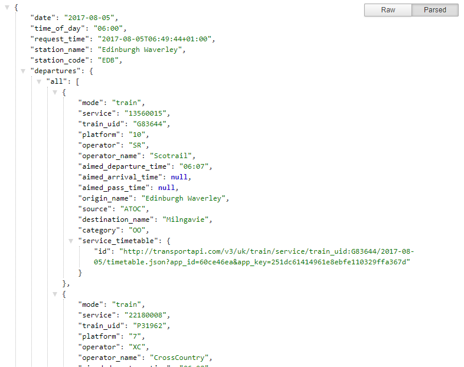


#### Service timetables 


Timetables for each train service can be also be obtained. This data
lets you see the arrival and departure times of a given train service at
the various stations it calls at on a given date and time. Let\'s try an
example out with service number, `23587103`, on
`2017-08-05` at `06:00`:


``` 
http://transportapi.com/v3/uk/train/service/23587103/2017-08-05/06:00/timetable.json?app_id=YOUR_APP_ID&app_key=YOUR_APP_KEY
```


##### Response 

The response we get for the service timetable is as follows:


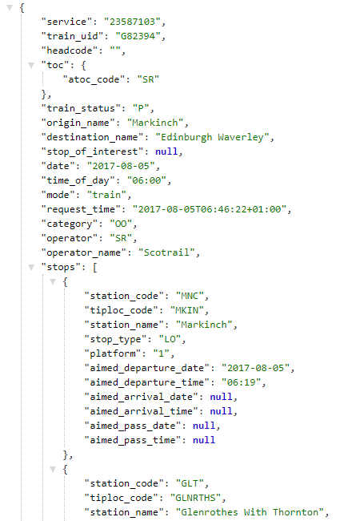


Building a simple SMS bot 
-------------------------------------------


Let\'s now build the SMS platform interface for the chatbot. Let us build a
bot to simply send SMS text messages to a mobile number. This could be a
message concerning the status of a train arriving at a station or the
next train to a certain destination from a given station. To do this, we will use a service called
Twilio. Twilio is a developer platform for communications enabling
developers to add messaging, voice, and video capabilities to their
software. We will explore how we can build notification bots and
chatbots using Twilio\'s messaging infrastructure.


### Getting started 


To get started with Twilio, perform the following steps:


1.  Go to [www.twilio.com](http://www.twilio.com/),
    click **`Sign Up`** and register yourself for a free trial account.
2.  Once you have registered, go over to the console page
    at [www.twilio.com/console](http://www.twilio.com/console).
3.  Copy the **`ACCOUNT SID`** and **`Account Key`**. We will be using
    them for our projects.


### Setting up the dashboard 


Let us build a bot that sends the notification to a user\'s mobile
number. Twilio has four main products: **`Programmable Chat`**,
**`Programmable SMS`**, **`Programmable Voice`**, and
**`Programmable Video`**. To build a notification sender, we need to use
the **`Programmable SMS`** service. Here are the steps:


1.  On the console dashboard, select **`Programmable SMS`**.
2.  On the **`Programmable SMS Dashboard`**, click **`Get Started`**:


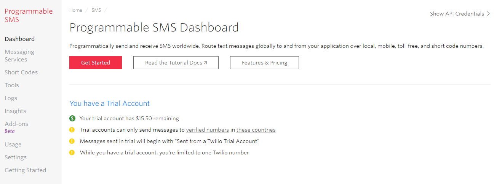


3.  In order to send SMS messages, you need a phone number.
    Click **`Get a number`** to get one:


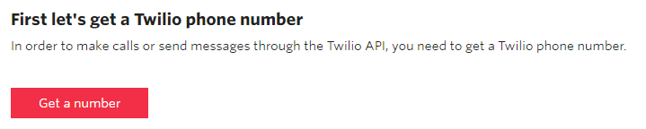


4.  This will provide you with a number. You can choose to accept it by
    clicking **`Choose this Number`**. If not, pick another one. Make
    sure that the number has SMS capability:


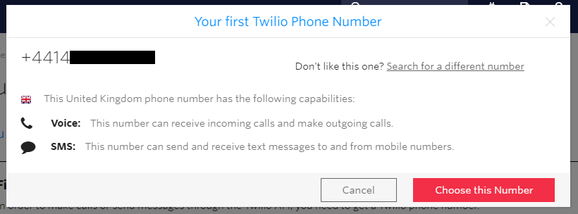


5.  You will receive an acknowledgment that you have been allocated the
    number:


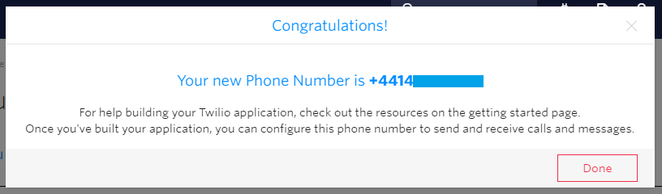


Click **`Done`**.


6.  Are you seeing the **`Send a Message`** window? Why don\'t you send
    yourself a message? Send a test message to your registered cellphone
    number (the number that you used to verify the account):


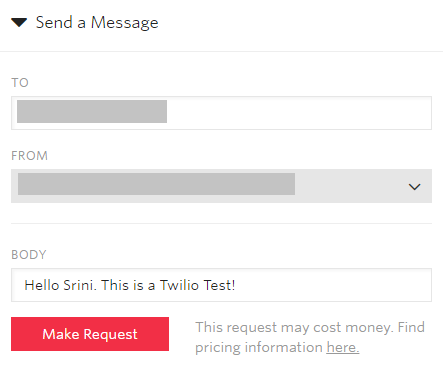


7.  Check your cellphone to see whether you have received your test
    message. Click **`Yes`** to inform Twilio that you have received
    your message.


### Simple Message Sender 


Now that we have set up the account and got a phone number, let\'s move
ahead to create a bot to send notifications. To do this, perform the
following steps:


1.  Open the console window and create a directory called
    `SMSBot`.


2.  In the `SMSBot` directory, create a new Node.js project
    using the `npm init` command, as shown here:


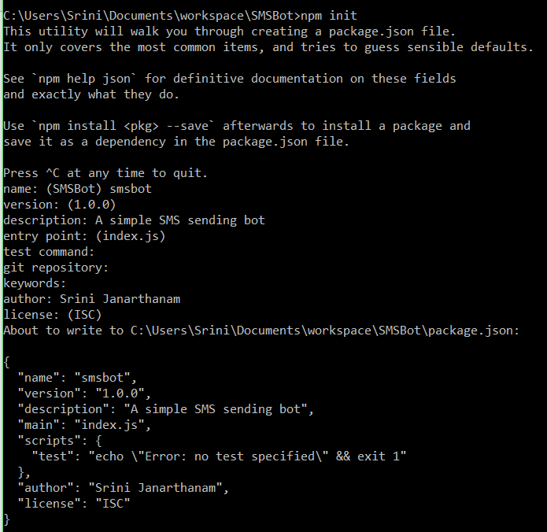


Check the directory to see the files that have been generated. You will
see a file called `package.json` with meta information
concerning the project. 


3.  We need to install the Twilio Node.js library to build our SMS bot.
    On the console, execute
    the `npm install twilio --save` command:


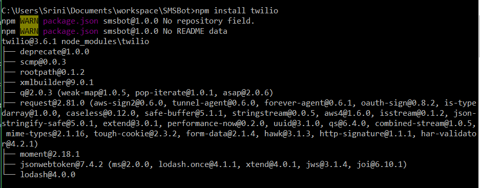


4.  Let\'s create a new JS file called `index.js`. Add the
    following code to the file:


``` 
//Index.js - SMSBot

//Add your Account SID 
varaccountSid='your_account_sid';
//Add your Auth Token here
varauthToken='your_auth_token';vartwilio=require('twilio');varclient=newtwilio(accountSid,authToken);
//Create a message with to and from numbers
client.messages.create({body:'Fenago says hello',to:'+447888999999',from:'+447888999990'}).then((message)=>console.log(message.sid));
```

In the preceding code, the `to` number must be a verified
number of trial accounts. You cannot send messages to other numbers
unless you upgrade your account. The `from` number is the
Twilio number that you had obtained previously.


5.  Save the file and execute it using the `node index.js`
    command. This should send the text message to your verified phone
    number. 


### My train notifier 


Imagine a scenario where a user commutes to work every day from
Edinburgh Waverley to Glasgow Queen Street. And they struggle to figure
out the trains and timings as they prepare to leave every morning.
Wouldn\'t it be great if we could provide a service that sends a list of
trains from their station to their destination at some point during
their morning routine?

Using the preceding Simple Message Sender module, let\'s build a bot
that will send a list of trains from a certain station to a certain
destination station. Let\'s add a module to get the list of trains from
a given station to a certain destination:


1.  Install the request library using
    `npm install request --save`.
2.  Create a function to send SMS notifications:


``` 
function sendSMS(msg, userPhoneNumber){
    var twilio = require('twilio');
    var client = new twilio(accountSid, authToken);
    //Create a message with to and from numbers
    client.messages.create({
        body: msg,
        to: userPhoneNumber, 
        from: '+4414XXXXXXXX' //YOUR_NUMBER 
    })
    .then((message) => console.log(message.sid));
}
```


3.  Create a function to get all trains departing from a given station:


``` 
 function getTrains(sourceStation, sourceStationCode, 
                                 destinationStation, 
                                 userPhoneNumber){
    var request = require('request');
    var url = 'http://transportapi.com/v3/uk/train/station/' + 
               sourceStationCode   + '/live.json?
               app_id=YOUR_APP_ID&app_key=YOUR_APP_KEY';

    request(url, function (error, response, body) {
       if (response){
            var json = JSON.parse(body);
            if (json.departures){
                //console.log('Departures:', 
                //JSON.stringify(json.departures)); 

                var dep = 
                getTrainsToDestination(destinationStation,
                json.departures.all);

                var summary = summarize(destinationStation, 
                                        sourceStation, dep);

                console.log('Summary: ' + summary);
                sendSMS(summary, userPhoneNumber);

            } else {
                console.log('No Departures found!');
            } 
        } else {
            console.log('error:', error); // Print the error if one 
                                          // occurred 
        }
    });
}
```


4.  Create a function to retrieve all trains going to a certain
    destination station:


``` 
function getTrainsToDestination(destination, allDepartures){
    var d = [];

    if (allDepartures){
        for (var i=0; i < allDepartures.length; i++){
            var service = allDepartures[i];
            if (service.destination_name == destination){
                d.push(service)
            }
        }
    }
    return d;
}
```


5.  Create a function to call the preceding functions to send the user a
    notification of all trains heading to a certain destination station
    from the user\'s preferred station:


``` 
function summarize(destinationStation, sourceStation, departures){

    var out = '';
    if (departures.length > 0){
        out = 'Here are the departures this morning to ' + 
               destinationStation 
                                 + ".\n";
        for (var i=0; i< departures.length; i++){
            var service = departures[i];
            var serviceSummary = service.operator_name 
                                 + " at " +    

            service.expected_departure_time; 
            out += serviceSummary + "\n"
        }
    } else {
        out = 'There are no trains to ' + destinationStation + 
                                                ' from ' + 
                                          sourceStation;
    }
    return out;
}
```


6.  And set the variables and call the main module:


``` 
//Index.js

//Add your Account SID 
varaccountSid='your_account_sid';
//Add your Auth Token here
varauthToken='your_auth_token';

var destinationStation = 'Glasgow Queen Street';
var userPhoneNumber = '+447888999999';
var sourceStationCode = 'EDB';
var sourceStation = 'Edinburgh Waverley';

getTrains(sourceStation, sourceStationCode, destinationStation, userPhoneNumber);
```


7.  Run it on the `node index.js` console to see whether it
    works. It should print the summary of trains to the destination
    station on the console and also send it as an SMS notification
    message to you:


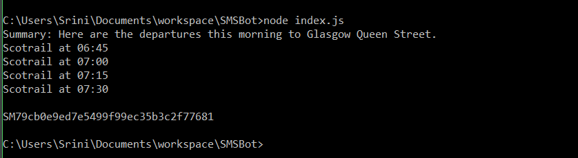


8.  Check your cellphone to see whether the message has arrived:


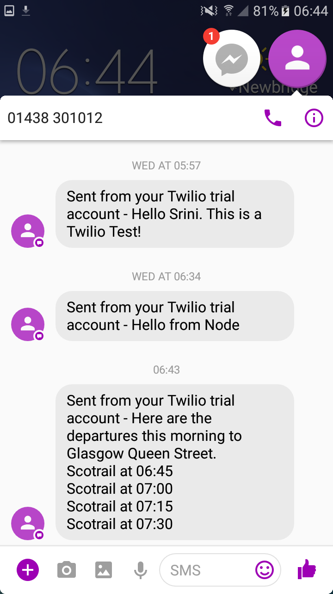


9.  Congratulations! You have just created an SMS bot. 


Summary 
-------------------------


Brilliant! I hope you had a great time exploring and building a
transport chatbot providing useful information on trains to users.
Besides building the chatbot, we also explored the use of Twilio
communication APIs to expose the chatbot over the SMS platform. I hope
you tried to chat with your bot over SMS and realized how easy it is to
get useful information without internet data. We did explore a few
conversational tasks and also got to implement a couple. However, you
could move on to more complex tasks, such as journey planning, based on
the chatbot model that we built in this lab. 