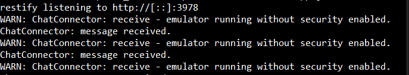
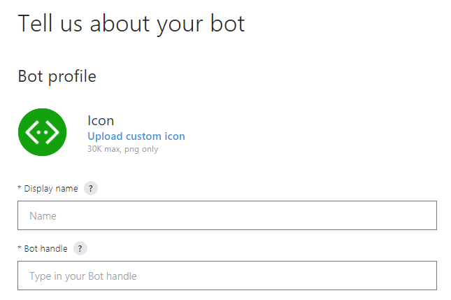

Lab 6. Restaurant Search 
-------------------------------------


In this lab, we are going to explore how a conversation management
module can be built using an existing library---Bot Builder SDK. First,
we will understand the MS Bot Framework that Bot Builder SDK is a part
of. We will install the necessary software and libraries and learn to
build chatbots using the SDK, test them on the emulator, and deploy them
in the cloud. Next, we will learn about the rich presentation options,
and the devices for which the conversational flow can be designed. We
will then explore the Zomato service for restaurant data and integrate
it into a chatbot built using the Bot Builder SDK. We will finally
deploy it on Skype.

By the end of this lab, you will be able to:


-   Understand the basics of MS Bot Framework
-   Build a chatbot with the Botbuilder Node.js library
-   Register the bot with Bot Framework
-   Host the bot in the cloud
-   Understand message types and card types
-   Integrate the bot with Skype


MS Bot Framework 
----------------------------------


MS Bot Framework is a Microsoft product for chatbot development. It
houses three products: Bot Builder SDK, Bot Framework Portal, and
channels. Bot Builder SDK is the toolkit for building chatbots. It has
libraries of classes and code that represent various elements of a
conversation. These can be used in our development process to build
chatbots at a faster pace than building them from scratch. The Bot
Framework Portal is used to register the bot in order to manage it
efficiently and there is a host of tools for analytics and diagnostics
that can be used on this portal. Finally, the framework provides a
unified approach to integrating with several channels.

There are a huge number of channels that you can integrate your bot
with, including Skype, Facebook Messenger, Kik, Telegram, Slack, MS
Teams, and Twilio. You can also create a web chat client using the
portal that can be embedded on any website. In addition to the three
tools, there are two other tools that are very useful during the
development process: channel emulator and channel inspector. 


### Channel emulator 


Before we begin, we need to install software called a channel emulator.
We will be using this to emulate the channel (for example, Skype) to
connect to the bot locally for development and testing purposes. You can
chat with your bot as well as inspect the messages sent and received to
identify any bugs.

To download it, go to the following page:

<https://github.com/Microsoft/BotFramework-Emulator/releases/tag/v3.5.31>

Download the version based on your needs and install it on your
computer.


Building a bot 
--------------------------------


Let us now look at the steps to build a chatbot. Here we will use the
botbuilder library and create a bot using Node.js:


1.  Create a Node.js project called `foodie-bot`:


``` 
> npm init
```


2.  Install the two libraries that we need to use:


``` 
> npm install botbuilder --save
> npm install restify --save
```


3.  Create a file named `app.js`. 
4.  In `app.js`, paste the following code (from the Bot
    Framework tutorials):


``` 
var restify = require('restify');
var builder = require('botbuilder');

// Lets setup the Restify Server
var server = restify.createServer();
server.listen(process.env.port || process.env.PORT || 3978, function () {
   console.log('%s listening to %s', server.name, server.url); 
});


// Create chat connector for communicating with the Bot Framework Service
var connector = new builder.ChatConnector({
    appId: process.env.MICROSOFT_APP_ID,
    appPassword: process.env.MICROSOFT_APP_PASSWORD
});


// Listen for messages from users 
server.post('/foodiebot', connector.listen());

// Echo their message back.. just parrotting!
var bot = new builder.UniversalBot(connector, function (session) {
    session.send("You said: %s", session.message.text);
}); 
```

Notice that there are two classes, `UniversalBot` and
`ChatConnector`, that the Bot Framework\'s Node.js SDK
provides. `UniversalBot` is the class where we define the
conversation flow, while the `ChatConnector` class connects
the bot to the chat channel. In the previous code, we used
the `session.send()` method to send text messages to the chat
channel.


5.  Save the file.
6.  Run the emulator. In the address bar, type the following address and
    connect:


`http://localhost:3978/api/messages`

At this stage, you don\'t have to provide an app ID or password.


7.  The emulator will connect to the bot (running in
    `app.js`). The app will start logging messages on the
    console, as shown here:





8.  In the emulator, in the following textbox, type a message to the bot
    and hit **`SEND`**. You will see that the bot repeats the message
    back to you:


9.  Congratulations! You have just created your first bot using Bot
    Framework.


### Deploying your bot  


For now, we have our bot running on a local machine and have interacted
with it over the channel emulator. How about we push it further and get
it talking to the user on a website. To do this, we need to register our
bot in Bot Framework\'s very own bot directory. To get your bot
registered, perform the following steps:


1.  Go to the Bot Framework page
    at [https://dev.botframework.com](https://dev.botframework.com/).
2.  Create an account, if you don\'t already have one. Sign in.
3.  Click the **`My bots`** tab.
4.  Click **`Create a bot`**:


5.  Click **`Create`**. Choose
    **`Register an existing bot built using Bot Builder SDK`**:


6.  Scroll down to **`Configuration`**.
    Click **`Create Microsoft App ID and Password`**:





Copy the app ID and password and hang on to it.


7.  Go back to `app.js` and replace the app ID and password
    variable with these new values. Save it. Alternatively, we can set
    these as configuration parameters.
8.  We are now ready to host our bot in the cloud and link it up to the
    Bot Framework register. In order to do that, we need to
    create `Procfile`. Create a file called
    `Procfile`, which tells Heroku how to start the app. Here
    is what goes into `Procfile`:


``` 
web: node app.js
```


9.  Create a Heroku web app:


``` 
> heroku create foodie-bot-sj
```


10. We need a Git repository to store our bot code: 


``` 
> git init 
> git add .
> git commit -m initial-commit
```


11. Finally, let\'s push the code: 


``` 
> git push heroku master
```

Now we need to set the app ID and password as config variables in
Heroku:


``` 
> heroku config:set MICROSOFT_APP_PASSWORD=<YOUR_APP_PASSWORD>
> heroku config:set MICROSOFT_APP_ID=<YOUR_APP_ID>
```


12. Having pushed the code onto the cloud, we can test it using the
    channel emulator. Type the URL of the bot, along with the app ID and
    password, and click **`CONNECT`**:


13. Once connected, type your message to the bot. You will see the bot
    parroting the messages that you send: 


Good work! Your bot is in the cloud and ready to be deployed on Skype
and other channels, but we will explore that later in the lab.


### More message types 


Now that we have set up the chatbot and have the emulator to test it,
let\'s try out more messaging options.


#### Sending more than one message per turn 


First, we can send more than one message at a time. So when the chatbot
gets its turn, it can send multiple messages using the
`session.send()` method:


``` 
var bot = new builder.UniversalBot(connector, [
    function (session) {
        session.send('Hello there!');
        session.send('Welcome to New India restaurant!');
        });
    }
]);
```


#### Prompting users for information 


To ask users for information, use the `builder.Prompts.text()`
method, as shown here: 


``` 
var bot = new builder.UniversalBot(connector, [
    function (session) {
        builder.Prompts.text(session, 'Hi! What is your name?');
    },
    function (session, results) {
        session.endDialog('Hello ' + results.response + '! 
                           My name is FoodieBot!');
    }
]);
```

`builder.Prompts.text()` can be used to get text data such as
the names of people and cities. The responses can be accessed using
`results.response`. Try the preceding code by replacing the
definition for the `bot` variable in the previous code for
`app.js`: 


You can get numeric data using `builder.Prompts.number()`:


``` 
var bot = new builder.UniversalBot(connector, [
    function (session) {
        builder.Prompts.number(session, 'Booking a table! 
                               For how many people?');
    },
    function (session, results) {
        session.endDialog('Ok. Looking for a table for ' +  
                          results.response + ' people.');
    }
]);
```


You can also ask users to choose one of the given options using
the `builder.Prompts.choice()` method:


``` 
var bot = new builder.UniversalBot(connector, [
    function (session) {
        builder.Prompts.choice(session, 'Booking a table! 
        Any specific cuisine?', ['Indian', 'Chinese', 'Italian']);
    },
    function (session, results) {
        session.endDialog('Ok. Looking for a ' + 
        results.response.entity + ' restaurant.');
    }
]);
```

Notice that the label for the choice (for example, `Indian`)
is stored in `results.response.entity`: 


You can also provide choices in the following format, instead of an
array, as shown here:


``` 
builder.Prompts.choice(session, 'Booking a table! Any specific cuisine?', 'Indian|Chinese|Italian');
```

You can also prompt for date and time and parse varied inputs such as
`tomorrow at 2pm`, `Saturday at 8`,
or `next Friday` using the `EntityRecognizer` class,
as follows:


``` 
builder.Prompts.time(session, "So when is the party?");
....
session.dialogData.partyDate = builder.EntityRecognizer.resolveTime([results.response]);
```


#### Rich messages 


Now that we know how to serve messages and prompts, let\'s dig a little
deeper to learn how to make it look more visually appealing by adding
images and cards. To do this, we will use Hero card. Hero card is a
template for presenting information in a rich format using images, URLs,
and so on. Here is an example:

 


``` 
var bot = new builder.UniversalBot(connector, [
    function (session) {
        var msg = new builder.Message(session);
        msg.attachmentLayout(builder.AttachmentLayout.carousel)
        msg.attachments([
            new builder.HeroCard(session)
                .title("Chennai Kitchen")
                .subtitle("Authentic South Indian Restaurant")
                .text("Great tasting dosas. 5 star reviews.")
                .images([builder.CardImage.create(session, 
                       'https://images.pexels.com/photos/221143/
                       pexels-photo-221143.jpeg?
                       w=940&h=650&auto=compress&cs=tinysrgb')])
                .buttons([
                    builder.CardAction.imBack(session, 
                    "book_table:chennai_kitchen", "Book a table")
                ]),
            new builder.HeroCard(session)
                .title("Mumbai Tandoor")
                .subtitle("Best Indian Restaurant in town")
                .text("Amazing reviews!")
                .images([builder.CardImage.create(session, 
                        'https://images.pexels.com/photos/45844/
                        spices-white-pepper-nutmeg-45844.jpeg?
                        w=940&h=650&auto=compress&cs=tinysrgb')])
                .buttons([
                    builder.CardAction.imBack(session, 
                    "book_table:mumbai_tandoor", "Book a table")
                ])
        ]);
        session.send(msg)

    }
]); 
```


For each Hero card, a title, subtitle, text, image, and button response
can be specified. In the preceding example, the buttons have been
programmed to send response messages back to the bot using
the `imBack()` method. However, you can also program it to
open a web page using the `openUrl()` method, as follows:


``` 
builder.CardAction.openUrl(session, 'https://mumbaitandoor.com/bookTable','Book a table');
```

There are other types of cards as well: Thumbnail card, Adaptive card,
Audio card, and Animation card, for example. For a complete list of
cards, please refer to the Bot Framework documentation
at <https://docs.microsoft.com/en-us/bot-framework/nodejs/bot-builder-nodejs-send-rich-cards>.

Thumbnail cards are similar to Hero cards but smaller. You can create
Thumbnail cards using the `ThumbnailCard` class, as shown
here:


``` 
new builder.ThumbnailCard(session)
                .title("Chennai Kitchen")
                .subtitle("Authentic South Indian Restaurant")
                .text("Great tasting dosas. 5 star reviews.")
                .images([builder.CardImage.create(session, 
                       'https://images.pexels.com/photos/221143/
                       pexels-photo-221143.jpeg?w=940&h=650&
                       auto=compress&cs=tinysrgb')])
                .buttons([
                    builder.CardAction.imBack(session,              
                    "book_table:chennai_kitchen", 
                    "Book a table")
                ])
```

Let\'s run the preceding code on the emulator:


Let\'s create a card to show GIF images. The `AnimationCard`
class can be used to display animated images:


``` 
newbuilder.AnimationCard(session)
        .title('Microsoft Bot Framework')
        .subtitle('Animation Card')
        .image(builder.CardImage.create(session,  
        'https://makeYourOwnCurry.com/curryAnimation.jpeg'))
        .media([
            { url:'http://i.giphy.com/Ki55RUbOV5njy.gif' }
        ])
```

Audio and Video cards can be used to present audio and video
information:


``` 
//Video card
newbuilder.VideoCard(session)
        .title('Chicken Tikka')
        .subtitle('from Sanjeev Kapoor Khazana')
        .text('Authentic Chicken Tikka recipe by Chef 
               Harpal Singh Sokhi')
        .image(builder.CardImage.create(session,  
               'https://commons.wikimedia.org/wiki/
               File:Chicken_Tikka_(1).jpg'))
        .media([
            { url: 'http://fakevideourl.com/makingofchickentikka.mp4' }
        ])
        .buttons([
            builder.CardAction.imBack(session, "order:chicken_tikka", "Order Chicken Tikka")
])
```


``` 
//Audio card

newbuilder.AudioCard(session)         
   .title('Delicious Chicken Tikka')         
   .subtitle('Must have at Mumbai Tandoor')         
   .text('User')         
   .image(builder.CardImage.create(session,   
          'https://commons.wikimedia.org/wiki/
          File:Chicken_Tikka_(1).jpg'))          
   .media([             
         { url:'http://fakeaudiourl.com/reviews1.wav' }         
   ])         
   .buttons([            
    builder.CardAction.imBack(session, "order:chicken_tikka",
    "Order Chicken Tikka")
])
```

Let\'s see how it looks on the emulator:


In addition to these cards, there is a special card called the Receipt
card which will present information in a receipt format. It can be used
to present an itemized bill with payment information, as follows:


``` 
new builder.ReceiptCard(session)
    .title('James White')
    .facts([
        builder.Fact.create(session, '12345', 'Order Number'),
        builder.Fact.create(session, 'VISA 2392-****', 
                            'Payment Method')
    ])
    .items([
        builder.ReceiptItem.create(session, '£ 6.50', 'Chicken Tikka')
            .quantity(1),
        builder.ReceiptItem.create(session, '£ 5.00', 'Garlic Naan')
            .quantity(2)
    ])
    .tax('£ 1.15')
    .total('£ 12.65')
    .buttons([
        builder.CardAction.imBack(session, 'sendemail',
                                  'Send by email')
    ])
```

Let\'s run it on the emulator:


Finally, there is a card that can be used to authenticate the user by
asking them to sign in. This flow can be initiated using the SignIn
card:


``` 
new builder.SigninCard(session)
        .text('Mumbai Tandoor Login')
        .button('Login', 'https://mumbaitandoor.com/login')
        ]);
```

Clicking the SignIn card takes the user to the web page where the user
can be authenticated:


Now that we have explored the cards, let\'s move on to implementing the
conversation flow.


### Conversation flow 


Now that we have a setup to test the chatbot and have explored a variety
of ways information can be presented to the user, let\'s examine the
ways in which conversation flow can be managed. The basic model
available to us is the waterfall model, where the conversation is
composed of a sequence of steps. Let\'s take the example of booking a
table at a restaurant where the conversation proceeds in the following
way: get the time of reservation, the number of people at the table, and
the name of the user: 


``` 
// Bot Dialogs
var bot = new builder.UniversalBot(connector, [
    function (session) {
        session.send('Welcome to New India restaurant!');
        builder.Prompts.time(session, 'Table reservations. 
                             What time?');
    },
    function (session, results) {
        session.dialogData.timeOfReservation = 
        builder.EntityRecognizer.resolveTime([results.response]);
        builder.Prompts.number(session, "And how many people?");
    },
    function (session, results) {
        session.dialogData.numberOfPeople = results.response;
        builder.Prompts.text(session, "And your name?");
    },
    function (session, results) {
        session.dialogData.nameOnReservation = results.response;
        session.send('Great! Your reservation is booked!');
    }
]);
```

Let\'s try this out on the emulator:


Let us dissect the code a little to understand what is happening. We
start by constructing a bot using the `UniversalBot` class. As
we build the bot, we specify the steps of the waterfall conversation as
an array of functions. This is the root dialogue. Each function is a
step in the conversation. At each step, the bot says or prompts the user
with a message. In case of prompts, it expects the user to respond. The
response is stored in `results.response`, which is updated to
the dialogue state managed in `session.dialogData`. This
assignment happens in the subsequent steps, the bot makes the next
utterance or prompts for more information. As we have discussed
previously, there are a variety of ways information can be prompted and
verified.

It is not always possible to map out the entire conversation as an array
of functions. What if there are parts of the conversation that repeat?
As programmers, we handle these situations using functions and methods.
A method would be a well-defined piece of code performing a specific
task and can be called for whenever it is required by the
`main` method or another method. Let\'s take, for example, the
task of payment when placing an order. Whether you are at the table or
ordering takeout, you will have to make payments the same way. The same
set of questions will be asked: paying by card or cash, the card number,
the name on the card, the CVV number, and so on. Imagine a payment
dialogue between the user and the bot. Will this dialogue be used in
more than one scenario? Wouldn\'t it be nice to keep the conversational
step of the payment dialogue separate and call the process whenever a
payment needs to be taken? This is what we can accomplish using the
`dialog()` method. 

The bot that we create using the `UniversalBot` class can be
provided conversational skills to carry out a variety of tasks, such as
payments and product listing, using the `dialog()` method.
These can then be called upon when necessary from the root dialogue.
Each `dialog()` method can be used to define a sub-dialogue,
and structurally will be an independent waterfall dialogue. Let\'s now
build a root dialogue and embed within it two sub-dialogues asking for
the order and asking for payment:


``` 
//Main dialogue
var bot = new builder.UniversalBot(connector, [
    function (session) {
        session.send("Welcome to New India restaurant.");
        session.beginDialog('askForOrder');
    },
    function (session) {
        session.beginDialog('askForPayment');
    },
    function (session) {
        session.send('Thanks for your order!');
        session.send(`Order summary: 
        ${session.conversationData.order}<br/>`+ 
            `Payment card number: 
        ${session.conversationData.cardNumber}<br/>`);
        session.endDialog();
    }
]);

// Ask for Order
bot.dialog('askForOrder', [
    function (session) {
        builder.Prompts.text(session, 'Whats your order?');
    },
    function (session, results) {
        session.conversationData.order = results.response;
        session.endDialog();
    }
]);

// Ask for payment
bot.dialog('askForPayment', [
    function (session) {
        builder.Prompts.text(session, 'Whats the card number?');
    },
    function (session, results) {
        session.conversationData.cardNumber = results.response;
        builder.Prompts.text(session, 'Whats the CVV number?');
    },
    function (session, results) {
        session.conversationData.cardCVVNumber = results.response;
        session.send('Thanks for the payment!');
        session.endDialog();
    }
])
```

In the preceding code, you can see three dialogues: root, asking for the
order, and asking for payment. Within the root dialogue, we use the
`session.beginDialog()` to call upon the sub-dialogues: 


Also, notice that we have been using `session.dialogData` to
store information from user utterances so far. But now, we are using
`session.conversationData`. We will explore the difference
between them later.

At this point, we need to understand the concept of [**dialog
stack**]. In the beginning, the dialog stack contains the root
dialogue. As sub-dialogues get called from the root, these are stacked
on top of the root dialogue. Sub-dialogues can themselves call other
sub-dialogues. These, in turn, get stacked over them. When a
sub-dialogue is finished, the bot returns the next dialogue in the stack
and continues doing so until there are no more. 


#### Responding to user utterances 


What we have now is a default conversation that starts the same way no
matter what the user says. You could say `hi`, or
`help`, or any other utterance and the bot would answer with a
welcome message. Another way in which a conversation can get started is
based on what the user says. 

Let us now explore how to respond when the user says `help` in
the middle of the conversation:


``` 
bot.dialog('help', function (session, args, next) {
    session.endDialog("Hi. I can take food orders.<br/>
                      Say 'continue' to continue?");
})
.triggerAction({
    matches: /^help$/i,
});
```

Responding to user utterances can be done by adding
`triggerAction()` with utterances specified as regular
expressions in the `matches` clause. Add the preceding code
to `app.js` and restart the server. Now the conversation may
go as follows:


The code we added allows the bot to respond to the `help` user
utterance. Notice how this overrides the current expectation of order
information that the bot is waiting for.

There are two other ways of interpreting user utterances: a custom
recognizer and using NLU services such as LUIS. Let us try the custom
recognizer first. To your bot, attach the following recognizer:


``` 
bot.recognizer({
  recognize: function (context, done) {
        var intent = { score: 0.0 };
        if (context.message.text) {
            switch (context.message.text.toLowerCase()) {
                case 'help':
                    intent = { score: 1.0, intent: 'get-help' };
                    break;
                case 'goodbye':
                    intent = { score: 1.0, intent: 'say-goodbye' };
                    break;
            }
        }
        done(null, intent);
    }
});
```

And create appropriate sub-dialogues for the intents:


``` 
bot.dialog('help', [
    function (session) {
        session.send('I can help you look for a 
                     restaurant or order a takeaway!');
        session.endDialog();
    }
]).triggerAction({
    matches: 'get-help'
});

bot.dialog('goodbye', [
    function (session) {
        session.send('Goodbye now!');
        session.endConversation();
    }
]).triggerAction({
    matches: 'say-goodbye'
});
```

While utterance patterns can be specified using the matches option for
each sub-dialogue, it is even better to organize them as intents using a
global recognizer for all sub-dialogues. This is to ensure that we do
not have to duplicate the regular expressions. Once the intents are
identified, they can be used to trigger appropriate sub-dialogues, as
shown here:


### Note 

LUIS is Microsoft\'s natural language understanding service. It is
similar to Google\'s API.AI and Amazon\'s Lex. Any of these tools can be
integrated with the bot to provide NLU services if custom recognizers
,such as the preceding, are not adequate. To explore this option
further, consult the official documentation
at <https://docs.microsoft.com/en-us/bot-framework/nodejs/bot-builder-nodejs-recognize-intent-luis>.


#### Keeping context intact 


Processing user utterances using sub-dialogues can take the conversation
out of context: 


What happened to the conversation when the user typed
`continue`, as mentioned in the help message? Does the
conversation continue? No, it doesn\'t.  The bot seems to
have completely forgotten what it was doing before. This is because the
dialog stack is cleared when user utterances are processed. It may be
ideal to clear the stack when the user wants to change the topic of the
conversation, but not when the user is asking for help.

There is a way to keep context intact even when users interrupt with
questions and remarks. This can be done by adding
the `onSelectAction` option to the sub-dialogue that gets
invoked. This will keep the dialog stack intact and not clear it:


``` 
bot.dialog('help', function (session, args, next) {
    session.endDialog("Hi there. I can take food orders.");
})
.triggerAction({
    matches: /^help$/i,
    onSelectAction: (session, args, next) => {
        session.beginDialog(args.action, args);
    }
});
```

So it is actually part of the design decision to designate where the
dialogue stack needs to be cleared and where it should not be. For
instance, when the user asks for help, it is better not to clear the
context as the help request could be related to the context. However, if
the user seems to be switching to another task (for example, asking for
a table booking when they are actually ordering food), it may be a good
idea to clear the context as it is not appropriate to return to taking
the food order once the table has been booked.


#### Context switching 


However, there may be cases where the user wants to switch from one task
to another. In such cases, we do not want to keep the dialog stack
intact. By not using the `onSelectAction` option, we can wipe
out dialog stack. However, it is also a good idea to let the user know
that the bot is going to abandon the current task to take up the next
task. This can be done using the `confirmPrompt` option in the
`triggerAction()` method:


``` 
bot.dialog('askForOrder', [
    ...
])
.triggerAction({
    matches: /^order food$/i,
    confirmPrompt: "Your food order will be abandoned. Are you sure?"
});

// Search for a restaurant
bot.dialog('searchRestaurant', [
    function (session) {
        session.send('Searching for a restaurant!');
        builder.Prompts.text(session, 'Where?');
    },
    function (session, results) {
        session.conversationData.searchLocation = results.response;
        session.endDialog();
    }
])
    .triggerAction({
    matches: /^restaurant search$/i,
    confirmPrompt: 'Your restaurant search task 
    will be abandoned. Are you sure?'
});
```

By appending the `triggerAction()` method to
the `askForOrder` dialogue, we will be able to respond to user
requests to order food at any point in the conversation. However, the
bot will proactively prompt them that any other task being done (for
example, booking a table) will be abandoned:


Notice how the confirm prompts are invoked when the user switches from
one task to other.


#### Contextual NLU 


It may also be ideal to provide help in a contextual way. For instance,
provide the user with a menu when they ask for help while ordering. Let
us see how utterances can be processed contextually. To do this, we need
to create a `help` sub-dialogue and append it to an existing
dialogue so that it can trigger when what the user says matches the
template provided:


``` 
 // Ask for Order
bot.dialog('askForOrder', [
    function (session) {
        builder.Prompts.text(session, 'Whats your order?');
    },
    function (session, results) {
        session.conversationData.order = results.response;
        session.endDialog();
    }
])
.beginDialogAction('orderHelpAction', 'orderHelp', 
                   { matches: /^help$/i });

// Contextual help for ordering
bot.dialog('orderHelp', function(session, args, next) {
    var msg = "You can order for Chicken Tikka Masala, 
    Paneer Butter Masala, Naan and Briyani.";
    session.endDialog(msg);
})
```

Notice how we use the `beginDialogAction()` method to link the
`orderHelp` sub-dialogue. `orderHelp` gets triggered
when the user says `help` during the food ordering step:


In the preceding conversation, asking for `help` does not
yield the standard response. Instead, we get a contextual one. 


#### Ending the conversation 


Finally, it is a good practice to end the conversation when the tasks
are finished. This is done by informing the user that the tasks are
finished, clearing out the dialogue stack, and resetting the
`session.conversationData` object. To do this, use the
`session.endConversation()` method. So, let us rewrite our
root dialogue with the `session.endConversation()` method:


``` 
//Main dialogue
var bot = new builder.UniversalBot(connector, [
    function (session) {
        session.send("Welcome to New India restaurant.");
        session.beginDialog('askForOrder');
    },
    function (session) {
        session.beginDialog('askForPayment');
    },
    function (session) {
        session.send('Thanks for your order!');
        session.send(`Order summary: ${session.conversationData.order}<br/>`+ 
            `Payment card number:  
        ${session.conversationData.cardNumber}<br/>`);
        session.endConversation();
    }
]);
```

You can also set a default dialogue that gets triggered when the user
says `Goodbye` and ends the conversation:


``` 
bot.dialog('endConversation', [
    session.endConversation("Goodbye!")
])
.endConversationAction(
    "endTasks", "Ok. Goodbye.",
    {
        matches: /^goodbye$/i,
        confirmPrompt: "Cancelling current task. Are you sure?"
    }
);
```

Now let\'s have a look at how we can store the context of the
conversation.


### Conversational state 


The state of the conversation can be stored in the form of key/value
pairs. There are four data stores that are available to do this. These
are housed within the `session` object:


-   `dialogData`: Remember, the conversation is divided into
    dialogs (the root dialogue and sub-dialogues initiated with
    `beginDialog()`). Within each dialog, the state can be
    maintained separately. This is done using
    `session.dialogData`, which we have used in the previous
    examples. It stores data pertaining to the current sub-dialogue, and
    each sub-dialogue has its own copy of the `dialogData`.
    When the dialogue finishes (that is, `endDialog()` is
    executed) and is removed from the dialog stack, this data is
    deleted.
-   `conversationData`: This stores data pertaining to the
    whole conversation and is shared among all members (that is, users)
    in the conversation. It gets cleared when the conversation ends or
    when `endConversation()` is executed. This data can be
    accessed using `session.conversationData`.
-   `privateConversationData`: This stores data pertaining to
    the whole conversation as `conversationData`, but is
    private to every individual member of the conversation. This is not
    shared with other members participating in the conversation. It gets
    cleared when the conversation ends or
    when `endConversation()` is executed. This data can be
    accessed using `session.privateConversationData`.
-    `userData`: Private data pertaining to a user can be
    stored here. This is persistent across conversations. Data such as
    the user\'s name, age, gender, address, phone number, email, and
    payment info can be stored here and be used in conversations. This
    data can be accessed using `session.userData`.


So far, we have covered a number of concepts in the Bot Builder toolkit
with examples worked out. We have examined how to set up a root dialogue
and take the conversational flow into sub-dialogues. We have explored
how to handle user utterances locally and globally, as well as the use
of various data objects to store user and conversation data. Let us now
proceed to building a bot with restaurant data.


Connecting to Skype 
-------------------------------------


Now that we have a chatbot to search for restaurants, push it back on to
Heroku cloud as before. Remember to change the `Procfile` as
we need to run `index.js` and not `app.js`. Having
set up the chatbot as a web app in Heroku, we are all set to deploy the
bot on Skype and other channels. 


1.  Go to your dashboard on Bot Framework
    at <https://dev.botframework.com/bots>:


2.  Choose your bot. You will see that your bot is already connected to
    two channels, **`Skype`** and **`Web Chat`**:


3.  You will also be able to see the chat client on the right side. If
    you do not see one, you should be able to open it by pressing the
    **`Test`** button. This is similar to the emulator. So go on and say
    `Hi` to the bot:


You should be able to chat with the bot here as it is in the cloud and
not on localhost. 


4.  Click **`Skype`**:


5.  Click **`Add to Contacts`**:


6.  Click **`Open Skype`**:


7.  Add the bot to your contacts and start chatting: 


Congratulations on your new bot in Skype. Now that we have created a bot
using Bot Builder SDK and deployed it on Skype, go explore all the other
options that we learned about but did not get to experiment with. Add a
user-profiling dialogue where the bot learns about the user\'s
preferences. Extend the restaurant search dialogue by asking follow-up
questions based on reviews, ratings, and price range once the
restaurants are found and need further sorting. Try to add natural
language support so that the user can switch between tasks easily. 


Summary 
-------------------------


In the previous labs, we explored and learned about how to build a
chatbot using a variety of tools. These include development environments
such as Chatfuel, natural language processing tools such as API.AI, and
channel-specific SDKs such as Messenger SDK. However, when it comes to
coding the conversational flow to manage the conversation, we either
used form-based tools or built it from scratch. However, there is a
middle path. MS Bot Framework offers the Bot Builder SDK that can be
used to develop conversation management modules that manage how the
dialogue flows between the bot and the user. The SDK models the elements
of conversations in an elegant manner allowing developers to build
chatbots quickly and easily. This gives developers greater flexibility
than drag-and-drop tools, and it saves time and effort compared to
building the bot from scratch.

In this lab, we learned how to built a bot with the Bot Builder SDK
and deploy it on the Skype channel. In the next lab, we will move on
to more advanced bots that are drastically different from those that we
have explored so far---the Twitter bot!
