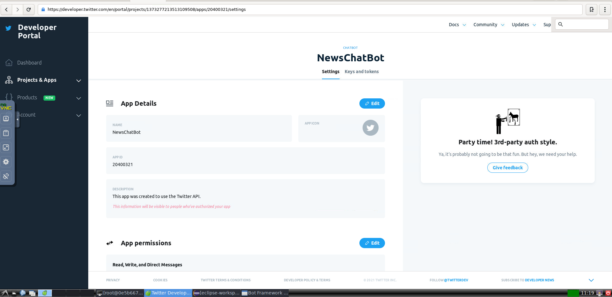
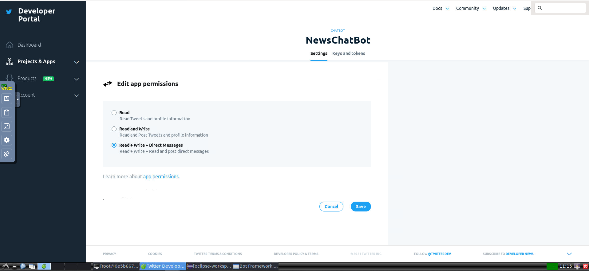
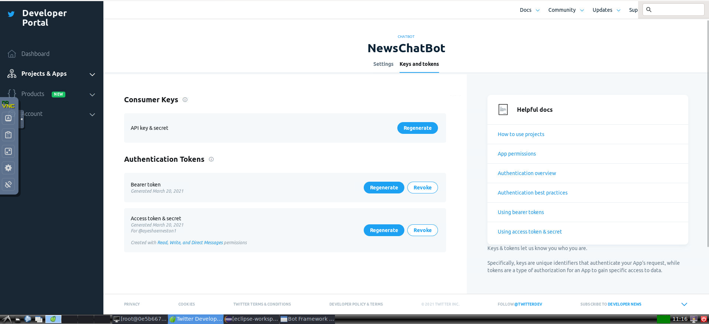

Lab 7. The News Bot 
--------------------------------


By the end of this lab, you will be able to:


-   Understand the basics of the Twitter API
-   Create a bot that listens to hashtags
-   Build a Twitter bot that tweets and retweets
-   Integrate NewsAPI and tweet top stories


### Lab Solution
Complete solution of this lab is present in following directory. Run "npm install" in the terminal to download node modules and run application:

`/root/Desktop/chatbots-development/Lab07`

Getting started with the Twitter app 
------------------------------------------------------


To get started, let us explore the Twitter developer platform. Let us
begin by building a Twitter app and later explore how we can tweet news
articles to followers based on their interests:


1.  Log on to Twitter at
    [www.twitter.com](https://twitter.com/). If you don\'t have an account on Twitter, create one.

2.  Go to <https://developer.twitter.com>, which is Twitter\'s application management dashboard.

3. Apply for Twiiter developer account.

4.  Create an application by filling in the form providing name & description




5.  Change App Permissions to "Read, Write, and Direct Messages"




6.  Copy *consumer key* and *consumer secret* ( i-e: API key & secret ) and hang on to them.

7.  Click `Access Token & Secret` to create a new token for your app:



8. Copy the `Access Token` and `Access Token Secret` and hang on to them.


Now, we have all the keys and tokens we need to create a Twitter app.


Building your first Twitter bot 
-------------------------------------------------


Let\'s build a simple Twitter bot. This bot will listen to tweets and
pick out those that have a particular hashtag. All the tweets with a
given hashtag will be printed on the console. This is a very simple bot
to help us get started. In the following sections, we will explore more
complex bots.


1.  Go to the root directory and create a new Node.js program using
    `npm init`:


2.  Execute the `npm install twitter --save` command to
    install the Twitter Node.js library:


Run `npm install request --save` to install the Request
library as well. We will use this in the future to make HTTP
`GET` requests to a news data source.


3.  Explore your `package.json` file in the root directory:


``` 
{
  "name": "twitterbot",
  "version": "1.0.0",
  "description": "my news bot",
  "main": "index.js",
  "scripts": {
    "test": "echo \"Error: no test specified\" && exit 1"
  },
  "author": "",
  "license": "ISC",
  "dependencies": {
    "request": "^2.81.0",
    "twitter": "^1.7.1"
  }
}
```


4.  Create an `index.js` file with the following code:


``` 
//index.js

var TwitterPackage = require('twitter');
var request = require('request');

console.log("Hello World! I am a twitter bot!");

var secret = {
 consumer_key: 'YOUR_CONSUMER_KEY',
 consumer_secret: 'YOUR_CONSUMER_SECRET',
 access_token_key: 'YOUR_ACCESS_TOKEN_KEY',
 access_token_secret: 'YOUR_ACCESS_TOKEN_SECRET'
}

var Twitter = new TwitterPackage(secret);
```

In the preceding code, put the keys and tokens you saved in their
appropriate variables. We don\'t need the `request` package
just yet, but we will later.


5.  Now let\'s create a [*hashtag listener*] to listen to the
    tweets on a specific hashtag:


``` 
//Twitter stream

var hashtag = '#brexit'; //put any hashtag to listen e.g. #brexit
console.log('Listening to:' + hashtag);

Twitter.stream('statuses/filter', {track: hashtag}, function(stream) {
  stream.on('data', function(tweet) {
    console.log('Tweet:@' + tweet.user.screen_name + 
                '\t' + tweet.text);
    console.log('------') 
  });

  stream.on('error', function(error) {
    console.log(error);
  });
});
```

Replace `#brexit` with the hashtag you want to listen to. Use
a popular one so that you can see the code in action. 


6.  Run the `index.js` file with
    the `node index.js` command.
7.  You will see a stream of tweets from Twitter users all over the
    globe who used the hashtag:


Congratulations! You have built your first Twitter bot. We will use the
hashtag listening module later in this lab to build a more complex
bot.


Exploring the Twitter SDK 
-------------------------------------------


In the previous section, we explored how to listen to tweets based on
hashtags. Let\'s now explore the Twitter SDK to understand the
capabilities that we can bestow upon our Twitter bot.


### Updating your status 


You can also update your status on your Twitter timeline by using the
following s[*tatus update*] module code:


``` 
tweet ('I am a Twitter Bot!', null, null);

function tweet(statusMsg, screen_name, status_id){

    console.log('Sending tweet to: ' + screen_name);
    console.log('In response to:' + status_id);
    var msg = statusMsg;
    if (screen_name != null){
        msg = '@' + screen_name + ' ' + statusMsg;
    }
    console.log('Tweet:' + msg);
    Twitter.post('statuses/update', {
            status: msg
        }, function(err, response) {
            // if there was an error while tweeting
            if (err) {
                console.log('Something went wrong while TWEETING...');
                console.log(err);
            }
            else if (response) {
                console.log('Tweeted!!!');
                console.log(response)
            }
    }); 
}
```

Comment out the hashtag listener code and instead add the preceding
status update code and run it. When run, your bot will post a tweet on
your timeline: 


In addition to tweeting on your timeline, you can also tweet in response
to another tweet (or status update).
The `screen_name` argument is used to create a
response. `tweet. screen_name` is the name of the user who
posted the tweet. We will explore this a bit later.


### Retweet to your followers 


You can retweet a tweet to your followers using the following r[*etweet
status*] code:


``` 
var retweetId = '899681279343570944';
retweet(retweetId);

function retweet(retweetId){
    Twitter.post('statuses/retweet/', {
        id: retweetId
    }, function(err, response) {
        if (err) {
            console.log('Something went wrong while RETWEETING...');
            console.log(err);
        }
        else if (response) {
            console.log('Retweeted!!!');
            console.log(response)
        }
    }); 
}
```


### Searching for tweets 


You can also search for recent or popular tweets with hashtags using the
following s[*earch hashtags*] code:


``` 
search('#brexit', 'popular')
function search(hashtag, resultType){
    var params = {
        q: hashtag, // REQUIRED
        result_type: resultType,
        lang: 'en'
    }

    Twitter.get('search/tweets', params, function(err, data) {
        if (!err) {
            console.log('Found tweets: ' + data.statuses.length);
            console.log('First one: ' + data.statuses[1].text);
        }
        else {
          console.log('Something went wrong while SEARCHING...');
        }
    });
}
```


Exploring a news data service 
-----------------------------------------------


Let\'s now build a bot that will tweet news articles to its followers at
regular intervals. We will then extend it to be personalized by users
through a conversation that happens over direct messaging with the bot.
In order to build a news bot, we need a source where we can get news
articles. We are going to explore a news service called NewsAPI.org in
this section. NewsAPI is a service that aggregates news articles from
roughly 70 newspapers around the globe. 


### Setting up NewsAPI 


Let us set up an account with the NewsAPI data service and get the API
key:


1.  Go to [newsapi.org](https://newsapi.org/):


2.  Click `Get API key`.
3.  Register using your email.
4.  Get your API key.


5.  Explore the sources:
    `https://newsapi.org/v1/sources?apiKey=YOUR_API_KEY`.


There are about 70 sources from across the globe including popular ones
such as BBC News, Associated Press, Bloomberg, and CNN. You might notice
that each source has a category tag attached. The possible options are:
business, entertainment, gaming, general, music, politics,
science-and-nature, sport, and technology. You might also notice that
each source also has language (`en`, `de`,
`fr`) and country (`au`, `de`,
`gb`, `in`, `it`, `us`) tags.
The following is the information on the BBC-News source:


``` 
{
    "id": "bbc-news",
    "name": "BBC News",
    "description": "Use BBC News for up-to-the-minute news,
    breaking news, video, audio and feature stories. 
    BBC News provides trusted World and UK news as well as 
    local and regional perspectives. Also entertainment, 
    business, science, technology and health news.",
    "url": "http://www.bbc.co.uk/news",
    "category": "general",
    "language": "en",
    "country": "gb",
    "urlsToLogos": {
        "small": "",
        "medium": "",
        "large": ""
    },
    "sortBysAvailable": [
        "top"
        ]
}
```


6.  Get sources for a specific category, language, or country using:


`https://newsapi.org/v1/sources?category=business&apiKey=YOUR_API_KEY`

The following is the part of the response to the preceding query asking
for all sources under the `business` category:


``` 
"sources": [
    {
        "id": "bloomberg",
        "name": "Bloomberg",
        "description": "Bloomberg delivers business 
        and markets news, data, analysis, and video 
        to the world, featuring stories from Businessweek 
        and Bloomberg News.",
        "url": "http://www.bloomberg.com",
        "category": "business",
        "language": "en",
        "country": "us",
        "urlsToLogos": {
            "small": "",
            "medium": "",
            "large": ""
        },
        "sortBysAvailable": [
        "top"
        ]
    },
    {
        "id": "business-insider",
        "name": "Business Insider",
        "description": "Business Insider is a fast-growing
        business site with deep financial, media, tech, and 
        other industry verticals. Launched in 2007, the 
        site is now the largest business news site on the web.",
        "url": "http://www.businessinsider.com",
        "category": "business",
        "language": "en",
        "country": "us",
        "urlsToLogos": {
            "small": "",
            "medium": "",
            "large": ""
        },
        "sortBysAvailable": [
        "top",
        "latest"
        ]
    },
    ...
]
```


7.  Explore the articles:


`https://newsapi.org/v1/articles?source=bbc-news&apiKey=YOUR_API_KEY`

The following is the sample response:


``` 
"articles": [
    {
        "author": "BBC News",
        "title": "US Navy collision: Remains found in 
                 hunt for missing sailors",
        "description": "Ten US sailors have been missing since Monday's 
                collision with a tanker near Singapore.",
        "url": "http://www.bbc.co.uk/news/world-us-canada-41013686",
        "urlToImage": 
        "https://ichef1.bbci.co.uk/news/1024/cpsprodpb/80D9/
                       production/_97458923_mediaitem97458918.jpg",
        "publishedAt": "2017-08-22T12:23:56Z"
    },
    {
        "author": "BBC News",
        "title": "Afghanistan hails Trump support in 'joint struggle'",
        "description": "President Ghani thanks Donald Trump for 
                       supporting Afghanistan's battle against the  
                       Taliban.",
        "url": "http://www.bbc.co.uk/news/world-asia-41012617",
        "urlToImage": 
        "https://ichef.bbci.co.uk/images/ic/1024x576/p05d08pf.jpg",
        "publishedAt": "2017-08-22T11:45:49Z"
    },
    ...
]
```

For each article, the `author`, `title`,
`description`, `url`, `urlToImage,`, and
`publishedAt` fields are provided. Now that we have explored a
source of news data that provides up-to-date news stories under various
categories, let us go on to build a news bot.


Building a Twitter news bot 
---------------------------------------------


Now that we have explored NewsAPI, a data source for the latest news
updates, and a little bit of what the Twitter API can do, let us combine
them both to build a bot tweeting interesting news stories on its own timeline:


Let\'s create a new JS file called `tweeter.js`. Copy code from index.js and paste  in the new file.


1.  Let\'s build a news tweeter module that tweets the top news article
    given the source. The following code uses the `tweet()`
    function we built earlier:


``` 
topNewsTweeter('cnn', null);

function topNewsTweeter(newsSource, screen_name, status_id){
    request({
            url: 'https://newsapi.org/v1/articles?source='
            + newsSource +    
                      '&apiKey=YOUR_API_KEY',
            method: 'GET'
        },
        function (error, response, body) {
            //response is from the bot
            if (!error && response.statusCode == 200) {
                var botResponse = JSON.parse(body);
                console.log(botResponse);
                tweetTopArticle(botResponse.articles, screen_name);
            } else {
                console.log('Sorry. No new');
            }
        });
}

function tweetTopArticle(articles, screen_name, status_id){
    var article = articles[0];
    tweet(article.title + " " + article.url, screen_name);
}
```

Run the preceding program to fetch news from CNN and post the topmost
article on Twitter:


Here is the post on Twitter:


2.  Now, let us build a module that tweets news stories from a
    randomly-chosen source in a list of sources:


``` 
function tweetFromRandomSource(sources, screen_name, status_id){
    var max = sources.length;
    var randomSource = sources[Math.floor(Math.random() * 
                              (max + 1))];
    //topNewsTweeter(randomSource, screen_name, status_id);
}
```


3.  Let\'s call the tweeting module after we acquire the list of
    sources:


``` 
function getAllSourcesAndTweet(){
    var sources = [];
    console.log('getting sources...')
    request({
            url: 'https://newsapi.org/v1/sources?
                 apiKey=YOUR_API_KEY',
                 method: 'GET'
        },
        function (error, response, body) {
            //response is from the bot
            if (!error && response.statusCode == 200) {
                // Print out the response body
                var botResponse = JSON.parse(body);
                for (var i = 0; i < botResponse.sources.length; 
                     i++){
                    console.log('adding.. ' + 
                                botResponse.sources[i].id)
                    sources.push(botResponse.sources[i].id)
                }
                tweetFromRandomSource(sources, null, null); 
            } else {
                console.log('Sorry. No news sources!');
            }
        });
}
```


4.  In the `tweeter.js` file, call `getSourcesAndTweet()` to get the process started: 


``` 
getAllSourcesAndTweet();
```


5.  Run the `tweeter.js` file on the console. This bot will
    tweet a news story every time it is called. It will choose top news
    stories from around 70 news sources randomly.


### Task: Tweet Every Hour

Create node js script and schedule a cron that tweets something every hour.


Summary 
-------------------------


In this lab, we have covered a lot. We started off with the Twitter
API and got a taste of how we can automatically tweet, retweet, and
search for tweets using hashtags. We then explored a News source API
that provides news articles from about 70 different newspapers. 