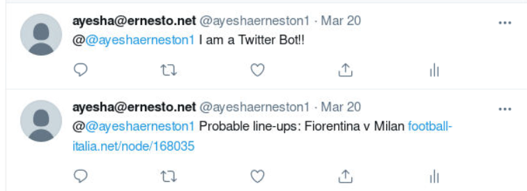
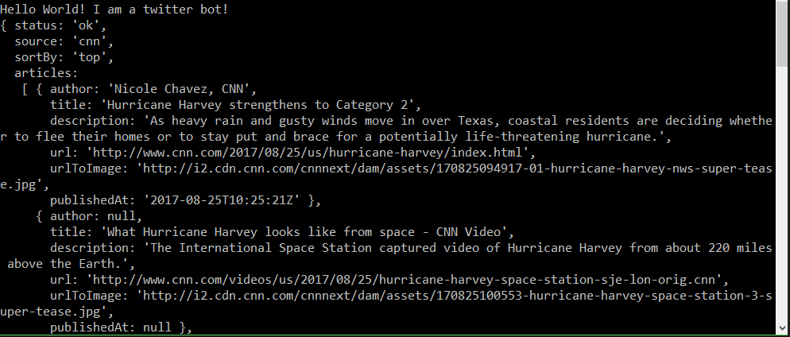
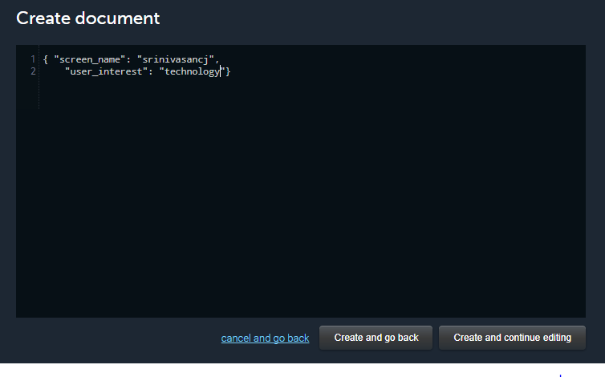

Chapter 7. The News Bot 
--------------------------------


So far we have explored how to build chatbots and deploy them in a
variety of messaging platforms such as Facebook Messenger, Skype, and
even SMS. We explored the different ways that tools, such as API.AI, can
be used in the context of chatbot building. In this chapter, we are
going to explore how chatbots can be integrated into Twitter, a social
media platform. There are many similar social media platforms, such as
Facebook and LinkedIn, that cater to different contexts and markets.
What we will explore in this chapter conceptually applies to all of
these platforms.

 Twitter is an online news and social media platform where users can
post and interact with messages that are called [**tweets**].
It has around 328 million active monthly users worldwide, with around
317 million active monthly users tweeting around 500 million tweets
every day (Statista 2017). Twitter is used by businesses as a tool for
brand engagement, product announcements, and customer service.

In this chapter, we will explore how to build chatbots on Twitter so
that tweets can be posted and responded to automatically and quickly. We
are going to build a news bot on the Twitter platform that tweets
current news on its timeline on a regular basis. It will also
personalize the experience for its followers by sending them news from
topics that they are interested in. We will first explore the Twitter
API and build core modules for tweeting, searching, and retweeting.
Then, we will explore a data source for news around the globe. We will
then build a simple bot that tweets top news on its timeline. Finally,
we will build a personalized news bot that listens to incoming tweets
from users about the topics that they are interested in and tweets
user-specific news to them.

By the end of this chapter, you will be able to:


-   Understand the basics of the Twitter API
-   Create a bot that listens to hashtags
-   Build a Twitter bot that tweets and retweets
-   Integrate NewsAPI and tweet top stories
-   Integrate MongoDB to track user interests
-   Build a conversational bot to get user interests and serve
    personalized news
-   Use Heroku Scheduler to tweet personalized news at a regular
    frequency


Getting started with the Twitter app 
------------------------------------------------------


To get started, let us explore the Twitter developer platform. Let us
begin by building a Twitter app and later explore how we can tweet news
articles to followers based on their interests:


1.  Log on to Twitter at
    [www.twitter.com](https://twitter.com/). If you don\'t have
    an account on Twitter, create one.
2.  Go to <https://apps.twitter.com/>, which is Twitter\'s application
    management dashboard.
3.  Click the **`Create New App`** button:


4.  Create an application by filling in the form providing name,
    description, and a website (fully-qualified URL). Read and agree to
    the **`Developer Agreement`** and hit
    **`Create your Twitter application`**:


5.  You will now see your application dashboard. Explore the tabs:


6.  Click **`Keys and Access Tokens`**: 


7.  Copy [*consumer key*] and [*consumer secret*]
    and hang on to them.
8.  Scroll down to **`Your Access Token`**:


9.  Click **`Create my access token`** to create a new token for your
    app:


10. Copy the **`Access Token`** and **`Access Token Secret`** and hang
    on to them.


Now, we have all the keys and tokens we need to create a Twitter app.


Building your first Twitter bot 
-------------------------------------------------


Let\'s build a simple Twitter bot. This bot will listen to tweets and
pick out those that have a particular hashtag. All the tweets with a
given hashtag will be printed on the console. This is a very simple bot
to help us get started. In the following sections, we will explore more
complex bots.


1.  Go to the root directory and create a new Node.js program using
    `npm init`:


2.  Execute the `npm install twitter --save` command to
    install the Twitter Node.js library:


Run `npm install request --save` to install the Request
library as well. We will use this in the future to make HTTP
`GET` requests to a news data source.


3.  Explore your `package.json` file in the root directory:


``` 
{
  "name": "twitterbot",
  "version": "1.0.0",
  "description": "my news bot",
  "main": "index.js",
  "scripts": {
    "test": "echo \"Error: no test specified\" && exit 1"
  },
  "author": "",
  "license": "ISC",
  "dependencies": {
    "request": "^2.81.0",
    "twitter": "^1.7.1"
  }
}
```


4.  Create an `index.js` file with the following code:


``` 
//index.js

var TwitterPackage = require('twitter');
var request = require('request');

console.log("Hello World! I am a twitter bot!");

var secret = {
 consumer_key: 'YOUR_CONSUMER_KEY',
 consumer_secret: 'YOUR_CONSUMER_SECRET',
 access_token_key: 'YOUR_ACCESS_TOKEN_KEY',
 access_token_secret: 'YOUR_ACCESS_TOKEN_SECRET'
}

var Twitter = new TwitterPackage(secret);
```

In the preceding code, put the keys and tokens you saved in their
appropriate variables. We don\'t need the `request` package
just yet, but we will later.


5.  Now let\'s create a [*hashtag listener*] to listen to the
    tweets on a specific hashtag:


``` 
//Twitter stream

var hashtag = '#brexit'; //put any hashtag to listen e.g. #brexit
console.log('Listening to:' + hashtag);

Twitter.stream('statuses/filter', {track: hashtag}, function(stream) {
  stream.on('data', function(tweet) {
    console.log('Tweet:@' + tweet.user.screen_name + 
                '\t' + tweet.text);
    console.log('------') 
  });

  stream.on('error', function(error) {
    console.log(error);
  });
});
```

Replace `#brexit` with the hashtag you want to listen to. Use
a popular one so that you can see the code in action. 


6.  Run the `index.js` file with
    the `node index.js` command.
7.  You will see a stream of tweets from Twitter users all over the
    globe who used the hashtag:


Congratulations! You have built your first Twitter bot. We will use the
hashtag listening module later in this chapter to build a more complex
bot.


Exploring the Twitter SDK 
-------------------------------------------


In the previous section, we explored how to listen to tweets based on
hashtags. Let\'s now explore the Twitter SDK to understand the
capabilities that we can bestow upon our Twitter bot.


### Updating your status 


You can also update your status on your Twitter timeline by using the
following s[*tatus update*] module code:


``` 
tweet ('I am a Twitter Bot!', null, null);

function tweet(statusMsg, screen_name, status_id){

    console.log('Sending tweet to: ' + screen_name);
    console.log('In response to:' + status_id);
    var msg = statusMsg;
    if (screen_name != null){
        msg = '@' + screen_name + ' ' + statusMsg;
    }
    console.log('Tweet:' + msg);
    Twitter.post('statuses/update', {
            status: msg
        }, function(err, response) {
            // if there was an error while tweeting
            if (err) {
                console.log('Something went wrong while TWEETING...');
                console.log(err);
            }
            else if (response) {
                console.log('Tweeted!!!');
                console.log(response)
            }
    }); 
}
```

Comment out the hashtag listener code and instead add the preceding
status update code and run it. When run, your bot will post a tweet on
your timeline: 





In addition to tweeting on your timeline, you can also tweet in response
to another tweet (or status update).
The `screen_name` argument is used to create a
response. `tweet. screen_name` is the name of the user who
posted the tweet. We will explore this a bit later.


### Retweet to your followers 


You can retweet a tweet to your followers using the following r[*etweet
status*] code:


``` 
var retweetId = '899681279343570944';
retweet(retweetId);

function retweet(retweetId){
    Twitter.post('statuses/retweet/', {
        id: retweetId
    }, function(err, response) {
        if (err) {
            console.log('Something went wrong while RETWEETING...');
            console.log(err);
        }
        else if (response) {
            console.log('Retweeted!!!');
            console.log(response)
        }
    }); 
}
```


### Searching for tweets 


You can also search for recent or popular tweets with hashtags using the
following s[*earch hashtags*] code:


``` 
search('#brexit', 'popular')
function search(hashtag, resultType){
    var params = {
        q: hashtag, // REQUIRED
        result_type: resultType,
        lang: 'en'
    }

    Twitter.get('search/tweets', params, function(err, data) {
        if (!err) {
            console.log('Found tweets: ' + data.statuses.length);
            console.log('First one: ' + data.statuses[1].text);
        }
        else {
          console.log('Something went wrong while SEARCHING...');
        }
    });
}
```


Exploring a news data service 
-----------------------------------------------


Let\'s now build a bot that will tweet news articles to its followers at
regular intervals. We will then extend it to be personalized by users
through a conversation that happens over direct messaging with the bot.
In order to build a news bot, we need a source where we can get news
articles. We are going to explore a news service called NewsAPI.org in
this section. NewsAPI is a service that aggregates news articles from
roughly 70 newspapers around the globe. 


### Setting up NewsAPI 


Let us set up an account with the NewsAPI data service and get the API
key:


1.  Go to [newsapi.org](https://newsapi.org/):


2.  Click **`Get API key`**.
3.  Register using your email.
4.  Get your API key.


5.  Explore the sources:
    `https://newsapi.org/v1/sources?apiKey=YOUR_API_KEY`.


There are about 70 sources from across the globe including popular ones
such as BBC News, Associated Press, Bloomberg, and CNN. You might notice
that each source has a category tag attached. The possible options are:
business, entertainment, gaming, general, music, politics,
science-and-nature, sport, and technology. You might also notice that
each source also has language (`en`, `de`,
`fr`) and country (`au`, `de`,
`gb`, `in`, `it`, `us`) tags.
The following is the information on the BBC-News source:


``` 
{
    "id": "bbc-news",
    "name": "BBC News",
    "description": "Use BBC News for up-to-the-minute news,
    breaking news, video, audio and feature stories. 
    BBC News provides trusted World and UK news as well as 
    local and regional perspectives. Also entertainment, 
    business, science, technology and health news.",
    "url": "http://www.bbc.co.uk/news",
    "category": "general",
    "language": "en",
    "country": "gb",
    "urlsToLogos": {
        "small": "",
        "medium": "",
        "large": ""
    },
    "sortBysAvailable": [
        "top"
        ]
}
```


6.  Get sources for a specific category, language, or country using:


`https://newsapi.org/v1/sources?category=business&apiKey=YOUR_API_KEY`

The following is the part of the response to the preceding query asking
for all sources under the `business` category:


``` 
"sources": [
    {
        "id": "bloomberg",
        "name": "Bloomberg",
        "description": "Bloomberg delivers business 
        and markets news, data, analysis, and video 
        to the world, featuring stories from Businessweek 
        and Bloomberg News.",
        "url": "http://www.bloomberg.com",
        "category": "business",
        "language": "en",
        "country": "us",
        "urlsToLogos": {
            "small": "",
            "medium": "",
            "large": ""
        },
        "sortBysAvailable": [
        "top"
        ]
    },
    {
        "id": "business-insider",
        "name": "Business Insider",
        "description": "Business Insider is a fast-growing
        business site with deep financial, media, tech, and 
        other industry verticals. Launched in 2007, the 
        site is now the largest business news site on the web.",
        "url": "http://www.businessinsider.com",
        "category": "business",
        "language": "en",
        "country": "us",
        "urlsToLogos": {
            "small": "",
            "medium": "",
            "large": ""
        },
        "sortBysAvailable": [
        "top",
        "latest"
        ]
    },
    ...
]
```


7.  Explore the articles:


`https://newsapi.org/v1/articles?source=bbc-news&apiKey=YOUR_API_KEY`

The following is the sample response:


``` 
"articles": [
    {
        "author": "BBC News",
        "title": "US Navy collision: Remains found in 
                 hunt for missing sailors",
        "description": "Ten US sailors have been missing since Monday's 
                collision with a tanker near Singapore.",
        "url": "http://www.bbc.co.uk/news/world-us-canada-41013686",
        "urlToImage": 
        "https://ichef1.bbci.co.uk/news/1024/cpsprodpb/80D9/
                       production/_97458923_mediaitem97458918.jpg",
        "publishedAt": "2017-08-22T12:23:56Z"
    },
    {
        "author": "BBC News",
        "title": "Afghanistan hails Trump support in 'joint struggle'",
        "description": "President Ghani thanks Donald Trump for 
                       supporting Afghanistan's battle against the  
                       Taliban.",
        "url": "http://www.bbc.co.uk/news/world-asia-41012617",
        "urlToImage": 
        "https://ichef.bbci.co.uk/images/ic/1024x576/p05d08pf.jpg",
        "publishedAt": "2017-08-22T11:45:49Z"
    },
    ...
]
```

For each article, the `author`, `title`,
`description`, `url`, `urlToImage,`, and
`publishedAt` fields are provided. Now that we have explored a
source of news data that provides up-to-date news stories under various
categories, let us go on to build a news bot.


Building a Twitter news bot 
---------------------------------------------


Now that we have explored NewsAPI, a data source for the latest news
updates, and a little bit of what the Twitter API can do, let us combine
them both to build a bot tweeting interesting news stories, first on its
own timeline and then specifically to each of its followers:


1.  Let\'s build a news tweeter module that tweets the top news article
    given the source. The following code uses the `tweet()`
    function we built earlier:


``` 
topNewsTweeter('cnn', null);

function topNewsTweeter(newsSource, screen_name, status_id){
    request({
            url: 'https://newsapi.org/v1/articles?source='
            + newsSource +    
                      '&apiKey=YOUR_API_KEY',
            method: 'GET'
        },
        function (error, response, body) {
            //response is from the bot
            if (!error && response.statusCode == 200) {
                var botResponse = JSON.parse(body);
                console.log(botResponse);
                tweetTopArticle(botResponse.articles, screen_name);
            } else {
                console.log('Sorry. No new');
            }
        });
}

function tweetTopArticle(articles, screen_name, status_id){
    var article = articles[0];
    tweet(article.title + " " + article.url, screen_name);
}
```

Run the preceding program to fetch news from CNN and post the topmost
article on Twitter:





Here is the post on Twitter:


2.  Now, let us build a module that tweets news stories from a
    randomly-chosen source in a list of sources:


``` 
function tweetFromRandomSource(sources, screen_name, status_id){
    var max = sources.length;
    var randomSource = sources[Math.floor(Math.random() * 
                              (max + 1))];
    //topNewsTweeter(randomSource, screen_name, status_id);
}
```


3.  Let\'s call the tweeting module after we acquire the list of
    sources:


``` 
function getAllSourcesAndTweet(){
    var sources = [];
    console.log('getting sources...')
    request({
            url: 'https://newsapi.org/v1/sources?
                 apiKey=YOUR_API_KEY',
                 method: 'GET'
        },
        function (error, response, body) {
            //response is from the bot
            if (!error && response.statusCode == 200) {
                // Print out the response body
                var botResponse = JSON.parse(body);
                for (var i = 0; i < botResponse.sources.length; 
                     i++){
                    console.log('adding.. ' + 
                                botResponse.sources[i].id)
                    sources.push(botResponse.sources[i].id)
                }
                tweetFromRandomSource(sources, null, null); 
            } else {
                console.log('Sorry. No news sources!');
            }
        });
}
```


4.  Let\'s create a new JS file called `tweeter.js`. In
    the `tweeter.js` file, call
    `getSourcesAndTweet()` to get the process started: 


``` 
//tweeter.js

var TwitterPackage = require('twitter');
var request = require('request');

console.log("Hello World! I am a twitter bot!");

var secret = {
  consumer_key: 'YOUR_CONSUMER_KEY',
  consumer_secret: 'YOUR_CONSUMER_SECRET',
  access_token_key: 'YOUR_ACCESS_TOKEN_KEY',
  access_token_secret: 'YOUR_ACCESS_TOKEN_SECRET'
}

var Twitter = new TwitterPackage(secret);
getAllSourcesAndTweet();
```


5.  Run the `tweeter.js` file on the console. This bot will
    tweet a news story every time it is called. It will choose top news
    stories from around 70 news sources randomly.


Building a personalized news bot 
--------------------------------------------------


We now have a news bot that tweets news (or posts status updates) on its
own timeline. We will look at how to set it to run on a regular basis in
a little while. Let us now build a more interesting bot that can tweet
to its followers using the news stories that they might like. In other
words, let\'s personalize the news:


1.  Let\'s assume that we have information about the users and their
    interests. Add the following to the `tweeter.js` file. For
    now, we are hardcoding the user interests information into the code
    itself. Later we will see how they can be stored and retrieved from
    a database:


``` 
var userInterests = [{'screen_name':'srinivasancj', 
                            'user_interest': 'technology'}];
```


2.  Create a `tweetUserSpecificNews` module that uses
    `userInterests` to get the category-specific sources. Call
    `tweetUserSpecificNews()` after
    `getAllSourcesAndTweet()`:


``` 
tweetUserSpecificNews();

function tweetUserSpecificNews(){
console.log('Tweeting personalised news');
    for (var i=0; i < userInterests.length; i++){
        var user = userInterests[i];
        var screen_name = user.screen_name;
        var interest = user.user_interest;
        var status_id = user.in_reply_to_status_id;
        //get sources
        request({
            url: 'https://newsapi.org/v1/sources?category=' + 
                  interest +   
                          '&apiKey=YOUR_API_KEY',
            method: 'GET'
        },
        function (error, response, body) {
            if (!error && response.statusCode == 200) {
                // Print out the response body
                var botResponse = JSON.parse(body);
                console.log(botResponse);
                var sources = [];
                for (var i = 0; i < botResponse.sources.length; 
                     i++)  
                {
                    console.log('adding.. ' + 
                                botResponse.sources[i].id)
                    sources.push(botResponse.sources[i].id)
                }
                tweetFromRandomSource(sources, screen_name, 
                                      status_id); 
            } else {
                console.log('Sorry. No news in this category.');
            }
        });
    }
}
```

By specifying the `screen_name` of a tweet from the user, the
tweets sent by the bot are treated as a response to the user\'s original
tweet. Therefore these tweets don\'t end up on the bot\'s timeline.
Instead they are sent directly to the user and therefore personalized to
the user.


3.  Now that we have a bot that, when run, updates its own timeline with
    a random news article and sends personalized news to its followers,
    let\'s make it run automatically on a regular basis, say, once an
    hour. To do this, we first need to create a web app and push it on
    to the Cloud.
4.  Create a `bin` folder and move
    the `tweeter.js` file into the `bin` folder.
5.  Rename the `tweeter.js` file to `tweeter`. And
    add the following code as the first line. This is to tell Heroku
    which interpreter program to use to run the script:


``` 
#!/usr/bin/env node
```


6.  In the project root directory, create a file
    named `Procfile` with the following code:


``` 
web: node index.js
```


7.  Create a local Git repository for the project, add files, and make
    an initial commit. Type the following command on the console:


``` 
> git init
> git add .
> git commit -m initial-commit-personalised-bot
```


8.  Create a Heroku app:


``` 
> heroku create my-twitter-bot
```


9.  Push the app onto Heroku Cloud:


``` 
> git push heroku master
```


10. Add a Heroku Scheduler:


``` 
> heroku addons:add scheduler
```


11. Open your Heroku Dashboard on a browser:


<https://dashboard.heroku.com/apps>


12. Choose your Twitter bot app and open the app\'s dashboard.
13. In the **`Overview`** tab, under **`Installed add-ons`**, you will
    find the Heroku Scheduler add-on listed. Click it:


14. You will now see the scheduled tasks for the app. Since we have just
    created this app, you won\'t see any. Click **`Add new job`**:


15. Type the name of the program that needs to run on a scheduled basis,
    in our case it is **`tweeter`**, and click **`Save`**:


16. The scheduler will now run the tweeter program on a regular basis,
    sending personalized news to subscribed users:


### Creating a database of user interests 


Now that we have a web app that runs regularly, tweeting personalized
news to users, let\'s move on to the next obvious step, which is
creating a database where the Twitter bot can pick up user information.
Currently, we have hardcoded this information into the bot, which is not
ideal. To create a database, let us use a MongoDB hosting service called
mlab.com.


### Note 

Be aware that for legal reasons, if you decide to make the bot publicly
available, you may have to inform users that the bot will store users\'
personal information.


To create a database for the twitter bot, follow these steps:


1.  Go to [www.mlab.com](https://mlab.com/).
    Click **`SIGN UP`**:


2.  Fill in your details and click **`Create Account`**.
3.  Verify your email by clicking the link that they send you. This will
    take you to the account dashboard:


4.  We need a MongoDB deployment. So, on the dashboard,
    click **`Create new`**:


5.  Choose any Cloud provider you like from the following three choices:
    **`a``mazon web services`**, **`Google Cloud Platform`**,
    or **`Microsoft Azure`**. 


6.  Click **`SANDBOX`**. Sandbox is a type of environment where you can
    play and practice with deployments before you move them on to
    production. Click **`CONTINUE`**:


7.  Choose the AWS region and click **`CONTINUE`**:


8.  Provide the final details, database name, and click **`CONTINUE`**:


9.  Check the details and click **`SUBMIT ORDER`** to finish:


You have now created a database called `twitterbot`, which can
be used to store information concerning user interests.


10. Create a new collection by double-clicking
    the `twitterbot` database entry: 


11. Click **`Add collection`**. Create a collection called
    `users`.
12. Now, in order to connect to a database, we need to define its users.
    To create a user, click the **`Users`** tab (next to
    **`Collections`**).
13. Click **`Add database user`**.
14. Create a new database user.


15. Get the URL of the database. It looks like this one:


`mongodb://<dbuser>:<dbpassword>@ds111804.mlab.com:11804/twitterbot`

Replace `<dbuser>` and `<dbpassword>` with the user
ID and password of the new database user that you just created. Hang on
to this.


16. Let\'s add some data into the `users` collection for the
    Twitter bot to read. Click the **`Collections`** tab and then the
    `users` collection.
17. Click **`Add document`**. Type the JSON object from the
    `user_interests` list. Click **`Create and go back`**:





18. Now you have your documents added to the collection:


Great! Now we have a MongoDB document database in the Cloud
([Mlab.com](https://mlab.com/)) to store information about user
interests. Let\'s now figure out how to use this database to store and
retrieve information on user interests with the bot.


### Accessing the user interests database 


In the previous section, we created a MongoDB document database where we
can store user information that will be used by the Twitter bot to
personalize news. In this section, we will see how to connect to the
database in real time with the bot.


1.  Install the `mongodb` library (version 2.2.31) using the
    `npm install` command:


``` 
> npm install mongodb@2.2.31 --save
```


2.  Test the connection by creating a Node.js program called
    `mongodb.js` with the following code: 


``` 
var MongoClient = require('mongodb').MongoClient;

// Connection URL
var url = 'YOUR_MONGO_DB_URI';

// Use connect method to connect to the server
MongoClient.connect(url, function(err, db) {
  console.log("Connected successfully to server");
  db.close();
});
```


3.  Run it to see whether the program is able to connect to your
    database.
4.  Add a function to the `mongodb.js` program to fetch all
    documents in your collection:


``` 
function findDocuments(db, callback) {
   // Get the documents collection
   var collection = db.collection('users');
   // Find documents
   collection.find({}).toArray(function(err, docs) {
       callback(docs);
   });
}
```


5.  Replace the `db.close()` call in `mongodb.js`
    with a call to the preceding function, as shown here:


``` 
var userInterests = [];

// Use connect method to connect to the server
MongoClient.connect(url, function(err, db) {
  console.log("Connected successfully to server");
  findDocuments(db, function(docs) {
      for (var i = 0; i < docs.length; i++){
          var user = {};
          user.screen_name = docs[i].screen_name;
          user.user_interest = docs[i].user_interest;
          userInterests.push(user);
      }
      db.close();
      console.log(userInterests);
  });
});
```


6.  Run it to see whether it fetches the document that we put into the
    collection:


You should be able to see the document that we already stored in the
`users` collection. Later we will see how to put more user
data into the collection using the Twitter bot.


7.  Now that we are able to successfully read user interests, let\'s
    wire this up to the bot so that it can send personalized news to
    users based on the information it finds in the database.
8.  Open the `tweeter` program in the `bin` folder.
    Replace the `userInterests` variable declaration with the
    following:


``` 
var MongoClient = require('mongodb').MongoClient;
// Connection URL
var url = 'YOUR_MONGO_DB_URI';
var userInterests = [];
loadUserData();
```


9.  Let\'s define the `loadUserData()` function that will load
    the user data from the document database:


``` 
function loadUserData(){
    // Use connect method to connect to the server
    MongoClient.connect(url, function(err, db) {
      console.log("Connected successfully to server");

      findDocuments(db, function(docs) {
          //console.log("Found the following records");
          for (var i = 0; i < docs.length; i++){
              var user = {};
              user.screen_name = docs[i].screen_name;
              user.user_interest = docs[i].user_interest;
              userInterests.push(user);
          }
          db.close();
          console.log(userInterests);

          //tweet to those followers who have 
          //expressed interest in specific categories
          tweetUserSpecificNews();
      });
    });
}
```


10. Notice how `tweetUserSpecificNews()` is now called after
    loading the `userInterests` array with data from the
    database. Remove the call to this function if one exists outside
    the `loadUserData()` function.


11. Run the program on the console (in the `bin` folder) to
    see it in action:


``` 
> node tweeter
```

This will fetch user interests from the database, query for all sources,
pick out user-specific sources, randomly select one, and tweet the top
news article from the selected source:


Great! We are now one step closer to a conversational Twitter bot. The
only piece of the puzzle that\'s missing is a way to tell the bot what
the user is interested in without having to manually create documents in
the database.


### Informing the bot of user interests 


Wouldn\'t it be interesting to have users tweet the bot about what they
are and are not interested in? The bot could then personalize the news
based on what the users say they like. The tweet conversation could go
like the one shown here:


``` 
User > I am interested in politics.
Bot tweets political news every hour.
User > Send me technology news.
Bot tweets technology and political news every hour.
User > Stop sending political news to me.
Bot tweets technology news every hour.
```

To make this Twitter conversation possible, we need a listener that
listens to tweets sent to the bot by users informing it of their
interests. This information, in natural language, needs to be parsed,
understood, and updated in the database. The hourly tweeter would tweet
personalized news based on the information it gets from the database.
Sound good? Let\'s get cracking on the tweet listener:


1.  Open the `index.js` file. Retain the code for importing
    the Twitter library and setting up the credentials:


``` 
var TwitterPackage = require('twitter');
var request = require('request');

var secret = {
  consumer_key: 'YOUR_CONSUMER_KEY',
  consumer_secret: 'YOUR_CONSUMER_SECRET',
  access_token_key: 'YOUR_ACCESS_TOKEN_KEY',
  access_token_secret: 'YOUR_ACCESS_TOKEN_SECRET'
}

var Twitter = new TwitterPackage(secret);
console.log("Hello World! I am a twitter bot!");
```


2.  Set up a tweet listener to listen to all tweets sent to the bot. My
    bot\'s Twitter handle is `@chatbotguru`:


``` 
//listening to incoming tweets 
Twitter.stream('user', {}, function(stream) {
    stream.on('data', function(tweet) {
        console.log(tweet); 

        var ct = /@chatbotguru/i;
        var userUtt = 'null';
        if (tweet.text.search(ct) != -1){
            userUtt = tweet.text.replace(ct, '');
            console.log('Tweet Msg:' + userUtt);
            console.log('Tweet from:' + '@' + 
            tweet.user.screen_name);
        }
    });
});
```


3.  Run the code. 


``` 
> node index.js
```


4.  Send a tweet from your personal Twitter account to your bot\'s
    account. For example,
    `@chatbotguru I am interested in business news`. This
    tweet will be received by the listener that we have just set up:


You should be able to see the tweet received by the bot on your Twitter
app, too:


5.  Now let\'s work on the message that we have received from the user.
    Let\'s examine the utterance for the topic of interest (politics,
    business, and so on) and the sentiment conveyed (interested/not
    interested). This is then used to insert or delete the user interest
    record in the database:


``` 
if (tweet.text.search(ct) != -1){
    userUtt = tweet.text.replace(ct, '');
    console.log('Tweet Msg:' + userUtt);
    console.log('Tweet from:' + '@' + tweet.user.screen_name);

    var userInterest = getInterestedGenre(userUtt);
    var userSentiment = getSentiment(userUtt);

    var user = { 'screen_name' : tweet.user.screen_name, 
                'user_interest' : userInterest};

    console.log(user);

    // Use connect method to connect to the server
    MongoClient.connect(url, function(err, db) {
       console.log("Connected successfully to server");
       var collection = db.collection('users');
       if (userSentiment == 'positive'){
           collection.insertMany([user], function(err, result) {
              if (err){
                  console.log(err); 
              } else { 
                  console.log("Inserted a user interest into the  
                              collection");
                  db.close();
              }
            });
       } else {
           collection.deleteOne(user, function(err, result) {
              console.log(err);
              console.log("Deleted a user interest from 
                          the collection");
              db.close();
            });
       }
    });
}
```


6.  Let\'s define the `getInterestedTopic()` and
    `getSentiment()` functions:


``` 
function getSentiment(text){
    if (text.search('not interested') != -1){
        return 'negative';
    }
    if (text.search('no more') != -1){
        return 'negative';
    }
    if (text.search('don\'t send') != -1){
        return 'negative';
    }
    if (text.search('no ') != -1){
        return 'negative';
    }
    if (text.search('dont like ') != -1){
        return 'negative';
    }
    if (text.search('unsubscribe ') != -1){
        return 'negative';
    }
    if (text.search('don\'t follow ') != -1){
        return 'negative';
    }
    if (text.search('stop ') != -1){
        return 'negative';
    }
    return 'positive';
}

function getInterestedGenre(text){
    if (text.search('tech') != -1 || 
        text.search('technology') != -1 ){
        return 'technology';
    }
    else if (text.search('all kinds') != -1){
        return 'general';
    }
    else if (text.search('politics') != -1 || 
             text.search('political') != -1){
        return 'politics';
    }
    else if (text.search('sports') != -1){
        return 'sport';
    }
    else if (text.search('business') != -1){
        return 'business';
    }
}
```

These are very simple definitions to start with. You could use NLU
toolkits, such as API.AI, to understand user utterances for more complex
functionality.


7.  For the preceding code to work, we also need to import the MongoDB
    library and set it up in the `index.js` file:


``` 
var MongoClient = require('mongodb').MongoClient;
var url = 'YOUR_MONGO_DB_URI';
```


8.  Run the code again, send a tweet, and see how it works. You will be
    able to see that the bot is now able to insert/delete records from
    the database. Go back to [mlab.com](https://mlab.com/) and
    have a look:


That\'s it! Your hourly tweeter will now be able to pick up the updates
in the database and tweet personalized news to all its users. Lastly,
push the changes to Heroku Cloud so that you don\'t have to keep
the `index.js` file running on your local machine.


Summary 
-------------------------


Hurray! You have built your very own conversational Twitter bot. I would
strongly recommend that you take this further and explore other kinds of
conversation that you can possibly have with the bot. How about having
the bot search and retweet hashtags automatically for you? How would you
use metrics, such as retweet counts, follower numbers, and like counts,
to qualify a tweet for retweeting? Explore these questions to build
better and more useful Twitter bots. 

In this chapter, we have covered a lot. We started off with the Twitter
API and got a taste of how we can automatically tweet, retweet, and
search for tweets using hashtags. We then explored a News source API
that provides news articles from about 70 different newspapers. We
integrated it with our Twitter bot to create a new tweeting bot. We
explored how to personalize it for users by using user interest tags
stored in a MongoDB database.
